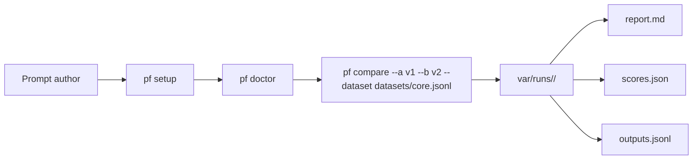

# PromptForge

_Last verified against commit `bf2bd3481eb50f6507094ec0e49bb6567bcab348`._

PromptForge is a CLI-first prompt evaluation harness for teams that version prompts,
run repeatable tests, and need evidence for why one prompt beat another.

It is built for:

- Prompt engineers comparing prompt pack revisions against a fixed dataset
- Operators who need a predictable local workflow and durable artifacts
- Technical and non-technical stakeholders who need a readable report, not raw model transcripts

What it does:

- Loads a versioned prompt pack from `prompt_packs/<version>/`
- Loads a JSONL evaluation dataset from `datasets/`
- Runs each case through one of three provider paths: `openai`, `openrouter`, or `codex`
- Scores outputs with deterministic rule checks plus a rubric judge
- Compares prompt versions case-by-case and overall
- Writes reproducible artifacts under `var/runs/<run_id>/`

What it does not do:

- It is not a web service or background worker
- It does not mutate datasets
- It does not include a human approval workflow
- It does not guarantee provider-side retention or privacy beyond the request flags it sends

## Why teams use it

- Faster prompt iteration with cached reruns and reproducible lockfiles
- Clear operator workflow: `setup`, `doctor`, `run`, `compare`, `report`
- Evidence-rich outputs for reviews, release decisions, and regressions
- Minimal local footprint: filesystem artifacts plus a single SQLite cache



## 5-minute quickstart

Prerequisites:

- Python 3.11+
- One auth path:
  - OpenAI API key, or
  - OpenRouter API key, or
  - A working Codex CLI login

Install and run:

```bash
make bootstrap
. .venv/bin/activate
pf setup
pf doctor
pf compare --a v1 --b v2 --dataset datasets/core.jsonl
```

What the wizard does:

- Creates or updates `.env` from `.env.example`
- Lets you choose `openai`, `openrouter`, or `codex`
- Stores provider defaults such as `PF_PROVIDER`, `OPENAI_BASE_MODEL`, and `OPENAI_JUDGE_MODEL`
- Prompts for API keys where needed
- Checks `codex login status` and can launch `codex login`

## Core workflow

1. Create or update a prompt pack in `prompt_packs/<version>/`.
2. Add or update dataset cases in `datasets/*.jsonl`.
3. Run `pf compare` or `pf run`.
4. Inspect `report.md`, `scores.json`, `comparison.json`, and `run.lock.json`.
5. Keep the winning prompt pack version and repeat.

## Key commands

| Command | Purpose | Typical use |
|---|---|---|
| `pf setup` | Interactive onboarding for auth and defaults | First-time setup, provider changes |
| `pf doctor` | Validate auth, model access, prompt pack, dataset, and workspace dirs | Preflight check before a run |
| `pf run --prompt v1 --dataset datasets/core.jsonl` | Evaluate one prompt pack | Score a single version |
| `pf compare --a v1 --b v2 --dataset datasets/core.jsonl` | Compare two prompt packs | Promotion or regression checks |
| `pf report --run <run_id>` | Print or rebuild a report for an existing run | Share or regenerate human-readable output |

Common provider examples:

```bash
pf run --prompt v1 --dataset datasets/core.jsonl --provider openai --model gpt-5.4
pf run --prompt v1 --dataset datasets/core.jsonl --provider openrouter --model openai/gpt-5
pf run --prompt v1 --dataset datasets/core.jsonl --provider codex --judge-provider codex --model gpt-5-mini
```

## Repository layout

```text
prompt_packs/                 Versioned prompt packs
datasets/                     JSONL evaluation datasets
src/promptforge/              CLI, runtime, scoring, providers, and setup flow
tests/                        Unit and integration-style tests
docs/                         Architecture, operations, security, ADRs, and reference docs
var/                          Generated logs, cache, and run artifacts
```

## Where to go next

- [Documentation index](docs/index.md)
- [Architecture](docs/architecture.md)
- [Runtime and pipeline](docs/runtime-and-pipeline.md)
- [CLI reference](docs/cli-reference.md)
- [Operations](docs/operations.md)
- [Security and safety](docs/security-and-safety.md)
- [Testing and quality](docs/testing-and-quality.md)
- [FAQ](docs/faq.md)
- [Architecture Decision Records](docs/adr/README.md)
- [Eval philosophy](docs/eval-philosophy.md)

## Source-of-truth modules

- CLI and command parsing: [`src/promptforge/cli.py`](src/promptforge/cli.py)
- Setup wizard: [`src/promptforge/setup_wizard.py`](src/promptforge/setup_wizard.py)
- Runtime orchestration: [`src/promptforge/runtime/run_service.py`](src/promptforge/runtime/run_service.py)
- Provider backends: [`src/promptforge/runtime/gateway.py`](src/promptforge/runtime/gateway.py)
- Data models: [`src/promptforge/core/models.py`](src/promptforge/core/models.py)
- Prompt and dataset loading: [`src/promptforge/prompts/loader.py`](src/promptforge/prompts/loader.py), [`src/promptforge/datasets/loader.py`](src/promptforge/datasets/loader.py)
