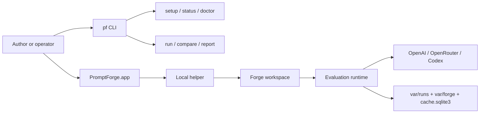

<p align="center">
  
</p>

# PromptForge

_Last verified against commit `4995d46a2ca16a3f56824412acc547118ed6d804`._

PromptForge is a local prompt engineering workbench.

It combines:

- a Python CLI for setup, health checks, batch evaluation, comparison, and reporting
- a macOS app for interactive prompt authoring with Forgie, saved case sets, and review results
- a local runtime that turns prompt packs and datasets into reproducible artifacts

PromptForge is for:

- developers building and iterating on prompt packs
- operators who need repeatable runs, inspectable artifacts, and recovery playbooks
- product and business stakeholders who need readable evidence instead of raw transcripts

PromptForge is not:

- a hosted service
- a multi-user control plane
- a background worker system
- a general-purpose agent runtime

## What You Get

- Versioned prompt packs under `prompt_packs/<version>/`
- JSONL datasets under `datasets/`
- Scenario suites under `scenarios/`
- Reproducible run artifacts under `var/runs/<run_id>/`
- Local forge sessions, revisions, proposals, and reviews under `var/forge/`
- A local SQLite response cache at `var/state/cache.sqlite3`
- Three provider paths: `openai`, `openrouter`, and `codex`
- Deterministic rule checks plus rubric judging



## 5-Minute Quickstart

### Prerequisites

- Python 3.11+
- One auth path:
  - `OPENAI_API_KEY`, or
  - `OPENROUTER_API_KEY`, or
  - a working `codex login`
- For the macOS app: a built or installed `PromptForge.app`

### From This Repository

```bash
make bootstrap
. .venv/bin/activate
pf setup
pf doctor
pf run --prompt v1 --dataset datasets/core.jsonl
pf forge
```

What this does:

1. creates a local virtualenv and installs the package
2. writes or updates `.env`
3. validates auth, model access, prompt resolution, and dataset resolution
4. runs one evaluation
5. opens the macOS workspace for interactive prompt work

### Starting A New Project Folder

PromptForge projects are just folders with a conventional layout. The CLI and app
create missing project scaffolding automatically.

```bash
mkdir my-prompt-project
cd my-prompt-project
pf status
pf prompts create --prompt draft-v1 --name "Draft v1"
pf forge
```

The first command that opens the project creates:

- `.promptforge/project.json`
- `prompt_packs/`
- `datasets/`
- `scenarios/`
- `var/`

## How PromptForge Is Organized

### Prompt pack

A prompt pack is a directory with required runtime files:

- `manifest.yaml`
- `system.md`
- `user_template.md`
- `variables.schema.json`

PromptForge also keeps prompt-level authoring metadata in:

- `prompt.json`

### Dataset

A dataset is a JSONL file. Each line becomes one `DatasetCase`.

### Scenario suite

A scenario suite is a saved set of product examples and assertions used for
review-style prompt checks.

### Run artifact

Every batch run writes:

- `run.json`
- `run.lock.json`
- `outputs.jsonl`
- `scores.json`
- `comparison.json`
- `report.md`

## Core Workflow

1. Create or update a prompt pack.
2. Add representative dataset cases.
3. Create or refine scenario suites for high-value behaviors.
4. Use `pf run` or `pf compare` for repeatable batch evidence.
5. Use `pf forge` to open the macOS workspace and iterate with Forgie.
6. Review diffs, failures, and results before promotion.

## Key Commands

| Command | Purpose | Typical use |
|---|---|---|
| `pf setup` | Configure auth and defaults | First-time setup, provider changes |
| `pf status` | Show current project and auth state | Fast local sanity check |
| `pf doctor` | Validate environment, auth, prompt, dataset, and model access | Preflight before running |
| `pf run --prompt v1 --dataset datasets/core.jsonl` | Evaluate one prompt pack | Day-to-day scoring |
| `pf compare --a v1 --b v2 --dataset datasets/core.jsonl` | Compare two prompt packs | Promotion and regression checks |
| `pf report --run <run_id>` | Rebuild or print a report | Share existing evidence |
| `pf prompts list` | List available prompt packs | Inspect project contents |
| `pf prompts create --prompt draft-v2 --from v1` | Create or clone a prompt pack | Start a new prompt version |
| `pf scenario list --prompt v1` | List case sets linked to a prompt | Operational review |
| `pf scenario run --suite core --prompt v1` | Run one saved scenario suite | Focused acceptance checks |
| `pf review --prompt v1 --json` | Show latest saved review for a prompt | Pull review state from CLI |
| `pf promote --prompt v1 --summary "Ship"` | Promote the current workspace to baseline | Record a ship decision |
| `pf forge` | Open the macOS app | Interactive prompt authoring |

## macOS App At A Glance

The macOS app is the interactive workspace. Its current structure is:

- left navigator: prompts, cases, and results
- chat pane: Forgie conversation only
- main pane: current document or review surface
- right inspector: prompt status, builder controls, activity, and selection details

Important behavior:

- opening a prompt is cheap and does not create a forge session by itself
- the first real action, such as chat, save, quick check, suite run, or playground run, creates a forge session lazily
- empty projects are valid; the app can open a project with no prompt packs and guide the user to create or import one

## Repository Layout

```text
apps/macos/PromptForge/       SwiftUI macOS app, bundled-engine build script, app tests
datasets/                     JSONL evaluation datasets
docs/                         Architecture, runtime, operations, security, testing, ADRs
prompt_packs/                 Versioned prompt packs and prompt.json metadata
scenarios/                    Saved scenario suites
src/promptforge/              CLI, runtime, scoring, helper, forge workspace, setup flow
tests/                        Python tests for contracts, runtime, helper, workspace, and CLI
var/                          Generated runs, forge sessions, logs, and cache
```

## Source-Of-Truth Modules

- CLI and command parsing: [src/promptforge/cli.py](src/promptforge/cli.py)
- Environment and defaults: [src/promptforge/core/config.py](src/promptforge/core/config.py)
- Project metadata: [src/promptforge/project.py](src/promptforge/project.py)
- Prompt loading: [src/promptforge/prompts/loader.py](src/promptforge/prompts/loader.py)
- Prompt brief metadata: [src/promptforge/prompts/brief.py](src/promptforge/prompts/brief.py)
- Dataset loading: [src/promptforge/datasets/loader.py](src/promptforge/datasets/loader.py)
- Runtime orchestration: [src/promptforge/runtime/run_service.py](src/promptforge/runtime/run_service.py)
- Provider gateways: [src/promptforge/runtime/gateway.py](src/promptforge/runtime/gateway.py)
- Artifact store: [src/promptforge/runtime/artifacts.py](src/promptforge/runtime/artifacts.py)
- Response cache: [src/promptforge/runtime/cache.py](src/promptforge/runtime/cache.py)
- Helper RPC server: [src/promptforge/helper/server.py](src/promptforge/helper/server.py)
- Forge workspace and sessions: [src/promptforge/forge/workspace.py](src/promptforge/forge/workspace.py), [src/promptforge/forge/service.py](src/promptforge/forge/service.py)
- Scenario suites: [src/promptforge/scenarios/models.py](src/promptforge/scenarios/models.py), [src/promptforge/scenarios/service.py](src/promptforge/scenarios/service.py)
- macOS app shell and model: [apps/macos/PromptForge/PromptForge/ContentView.swift](apps/macos/PromptForge/PromptForge/ContentView.swift), [apps/macos/PromptForge/PromptForge/Item.swift](apps/macos/PromptForge/PromptForge/Item.swift)

## Read Next

- [Documentation index](docs/index.md)
- [Architecture](docs/architecture.md)
- [Data model](docs/data-model.md)
- [Runtime and pipeline](docs/runtime-and-pipeline.md)
- [CLI reference](docs/cli-reference.md)
- [Operations](docs/operations.md)
- [Security and safety](docs/security-and-safety.md)
- [Testing and quality](docs/testing-and-quality.md)
- [FAQ](docs/faq.md)
- [Architecture Decision Records](docs/adr/README.md)

<p align="center">
  
</p>
