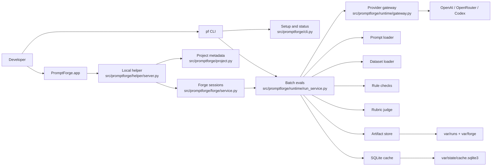
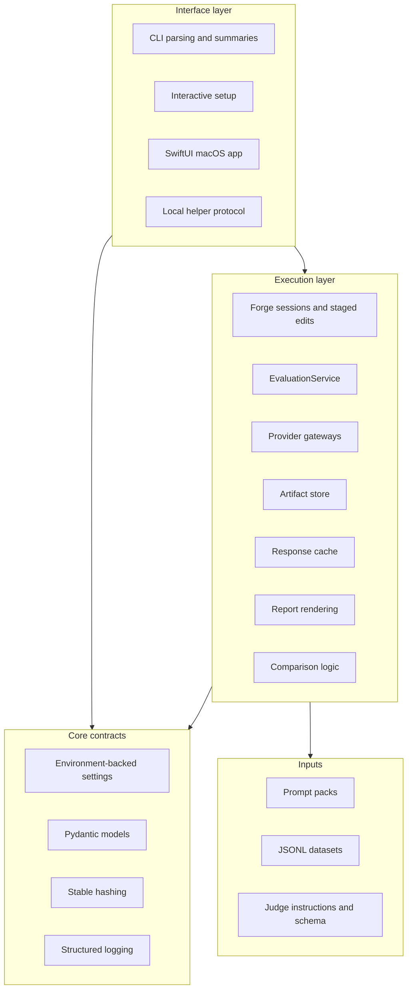
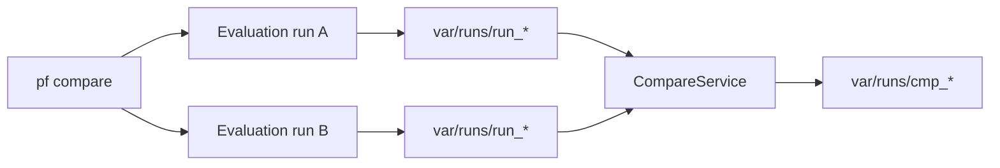

# Architecture

_Last verified against commit `065f5120dee568fe5b33c7565e7d62942d325db0`._

PromptForge is a local, macOS-first prompt engineering system with a Python
engine. The app is the primary interactive surface. The CLI remains the setup,
status, and batch execution surface.

It is intentionally narrow:

- No hosted backend
- No external database beyond a local SQLite cache
- No approval or multi-user control plane

The implementation now centers on:

- macOS app shell in `apps/macos/PromptForge/`
- local helper in `src/promptforge/helper/server.py`
- project metadata in `src/promptforge/project.py`
- per-prompt workspace metadata in `src/promptforge/prompts/brief.py`
- forge session orchestration in `src/promptforge/forge/service.py`
- batch execution in `src/promptforge/runtime/run_service.py`
- provider abstraction in `src/promptforge/runtime/gateway.py`
- persisted artifacts in `src/promptforge/runtime/artifacts.py`
- local response caching in `src/promptforge/runtime/cache.py`

## System overview

## Module boundaries

## Component responsibilities

| Area | Files | Responsibility |
|---|---|---|
| Command surface | `src/promptforge/cli.py` | Parses commands, launches the app on macOS, and runs batch commands |
| App shell | `apps/macos/PromptForge/PromptForge/*.swift` | Presents project, prompt overview, prompt editor, transcript, settings, and onboarding state in the macOS UI, and hydrates app API keys from macOS Keychain before helper launch |
| Helper boundary | `src/promptforge/helper/server.py` | Exposes a local Unix-socket RPC surface for the macOS app, including long-poll event subscriptions, prompt save/load, prompt-scoped benchmark history, and agent chat methods |
| Project metadata | `src/promptforge/project.py` | Stores `.promptforge/project.json` and shared non-secret defaults |
| Prompt workspace metadata | `src/promptforge/prompts/brief.py` | Stores `prompt_packs/<version>/prompt.json` intent fields for each prompt |
| Onboarding | `src/promptforge/setup_wizard.py` | Creates or updates `.env`, configures auth, and launches provider login flows |
| Presentation | `src/promptforge/ui.py` | Rich terminal panels, tables, and banners |
| Settings | `src/promptforge/core/config.py` | Reads environment variables and exposes default paths and provider settings |
| Contracts | `src/promptforge/core/models.py` | Defines prompt pack, dataset, run config, score, cache, and comparison models |
| Forge runtime | `src/promptforge/forge/service.py`, `src/promptforge/forge/workspace.py` | Creates staged prompt-edit proposals, applies revisions, tracks benchmark history, and persists the active prompt workspace view |
| Prompt loading | `src/promptforge/prompts/loader.py`, `src/promptforge/prompts/brief.py` | Resolves prompt pack paths, loads prompt files and `prompt.json`, validates inputs, and renders the user prompt |
| Dataset loading | `src/promptforge/datasets/loader.py` | Loads JSONL into `DatasetCase` objects and computes dataset hashes |
| Provider execution | `src/promptforge/runtime/gateway.py` | Sends generation and judge requests through OpenAI-compatible APIs or Codex |
| Execution orchestration | `src/promptforge/runtime/run_service.py` | Creates runs, executes cases, scores outputs, persists artifacts, and builds comparisons |
| Deterministic scoring | `src/promptforge/scoring/rules.py` | Required sections, required strings, JSON validity, policy markers, and word-count checks |
| Rubric scoring | `src/promptforge/scoring/judge.py`, `src/promptforge/agents/prompt_judge/*` | Builds judge payloads and enforces a structured scoring schema |
| Persistence | `src/promptforge/runtime/artifacts.py`, `src/promptforge/runtime/cache.py` | Writes run artifacts to disk and memoizes model outputs in SQLite |
| Reporting | `src/promptforge/runtime/report_service.py` | Renders Markdown summaries for evaluation and comparison runs |

## Interactive prompt flow

The app now treats prompt browsing and prompt execution as separate costs.

- Opening a project or clicking a prompt loads prompt files and prompt metadata only.
- The helper does not create a forge session or benchmark a prompt just to render the dashboard.
- A forge session is created lazily on the first agent chat, staged edit, prompt save into a working session, or explicit benchmark/evaluation request.
- Quick benchmarks and full evaluations are explicit user actions; they are no longer hidden behind prompt open or ordinary save flows.

### What runs locally

- macOS app rendering
- helper process and Unix socket transport
- CLI parsing and setup
- Prompt and dataset loading
- JSON schema validation
- Local cache reads and writes
- Run artifact generation
- Structured logging

### What leaves the machine

- Generated prompt requests sent to the selected provider
- Judge payloads, which include rendered prompts, case data, and model output, sent to the selected judge provider

### What is intentionally absent

- No remote HTTP server
- No message queue
- No scheduler
- No multi-tenant data model
- No approval workflow

## Comparison topology

The compare command does not score two versions in-memory and then discard the
details. It materializes two full evaluation runs first, then writes a third
comparison run that references the child run IDs in `run.json.notes`.

## Practical architecture implications

- PromptForge is still local-first: app, helper, and CLI all operate on the same project folder.
- Reproducibility comes from content hashes, `run.lock.json`, and the SQLite cache rather than from a database-backed control plane.
- Operators can diagnose almost everything from `pf status`, `pf doctor`, `var/logs/promptforge.log`, and the run directory.
- Scaling beyond local or CI-style use would require new architecture. There is no current worker pool, API layer, or remote state store.

## Source of truth

- [`../src/promptforge/cli.py`](../src/promptforge/cli.py)
- [`../src/promptforge/helper/server.py`](../src/promptforge/helper/server.py)
- [`../src/promptforge/project.py`](../src/promptforge/project.py)
- [`../src/promptforge/forge/service.py`](../src/promptforge/forge/service.py)
- [`../src/promptforge/runtime/run_service.py`](../src/promptforge/runtime/run_service.py)
- [`../src/promptforge/runtime/gateway.py`](../src/promptforge/runtime/gateway.py)
- [`../src/promptforge/runtime/artifacts.py`](../src/promptforge/runtime/artifacts.py)
- [`../src/promptforge/runtime/cache.py`](../src/promptforge/runtime/cache.py)
