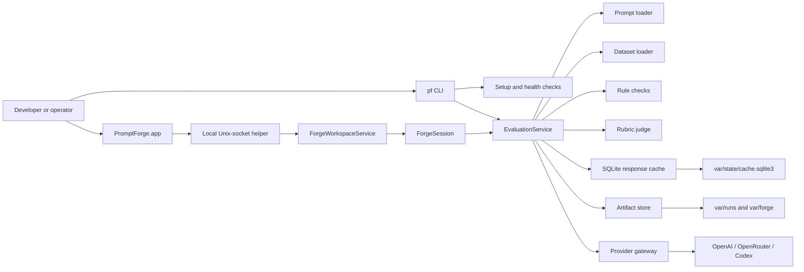
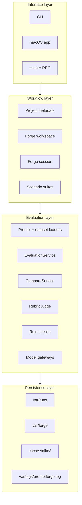
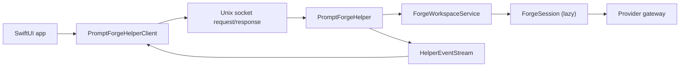
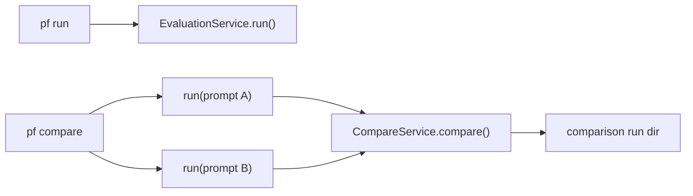

# Architecture

_Last verified against commit `4995d46a2ca16a3f56824412acc547118ed6d804`._

PromptForge is a local prompt engineering system with two user-facing surfaces:

- a CLI for setup, health checks, batch evaluation, comparison, reporting, and scenario operations
- a macOS app for interactive prompt authoring, Forgie chat, case editing, and result review

Everything runs against a local project folder. There is no hosted backend.

## System Overview

## Design Boundaries

PromptForge is intentionally narrow:

- local-first, single-project workflows
- file-backed artifacts and state
- no remote API server
- no scheduler, queue, or worker pool
- no multi-user approval workflow

That design shows up directly in the code:

- CLI entrypoint: [src/promptforge/cli.py](../src/promptforge/cli.py)
- helper RPC server: [src/promptforge/helper/server.py](../src/promptforge/helper/server.py)
- project metadata: [src/promptforge/project.py](../src/promptforge/project.py)
- forge workspace: [src/promptforge/forge/workspace.py](../src/promptforge/forge/workspace.py)
- runtime execution: [src/promptforge/runtime/run_service.py](../src/promptforge/runtime/run_service.py)

## Component Responsibilities

| Area | Files | Responsibility |
|---|---|---|
| CLI surface | `src/promptforge/cli.py` | Parses commands, runs batch operations, prints status, launches the app |
| Setup flow | `src/promptforge/setup_wizard.py` | Creates or updates `.env`, chooses providers, validates auth flow |
| App shell | `apps/macos/PromptForge/PromptForge/ContentView.swift` | Navigator, chat, editor, cases, results, inspector, settings UI |
| App model | `apps/macos/PromptForge/PromptForge/Item.swift` | Helper client, app state, event subscription, prompt save/load, review and playground actions |
| Runtime locator | `apps/macos/PromptForge/PromptForge/PromptForgeApp.swift`, `Item.swift` | Resolves explicit, bundled, saved, or debug fallback engine roots |
| Helper RPC boundary | `src/promptforge/helper/server.py` | Exposes project, prompt, scenario, review, benchmark, and agent methods over a local socket |
| Project metadata | `src/promptforge/project.py` | Stores `.promptforge/project.json` and initializes missing project directories |
| Prompt metadata | `src/promptforge/prompts/brief.py` | Stores `prompt.json` per prompt pack |
| Prompt loading | `src/promptforge/prompts/loader.py` | Loads required prompt-pack files, validates them, renders user prompts |
| Dataset loading | `src/promptforge/datasets/loader.py` | Loads JSONL datasets and computes dataset hashes |
| Forge workspace | `src/promptforge/forge/workspace.py` | Lists prompts, tracks active prompt/session, saves workspace changes, runs scenarios, playground, and reviews |
| Forge session | `src/promptforge/forge/service.py` | Owns working prompt copy, revisions, staged edits, benchmark runs, restore/promote flows |
| Core contracts | `src/promptforge/core/models.py` | Typed models for prompt packs, datasets, runs, scores, comparisons, cache rows |
| Runtime | `src/promptforge/runtime/run_service.py` | Runs evaluations, compares prompt versions, writes artifacts |
| Provider boundary | `src/promptforge/runtime/gateway.py` | OpenAI-compatible and Codex execution plus mixed-provider composition |
| Deterministic scoring | `src/promptforge/scoring/rules.py` | Required sections, required strings, forbidden strings, JSON validity, word limits, policy markers |
| Rubric judging | `src/promptforge/scoring/judge.py` | Judge request assembly and typed parsing of rubric output |
| Persistence | `src/promptforge/runtime/artifacts.py`, `src/promptforge/runtime/cache.py` | Filesystem run artifacts and SQLite generation cache |
| Scenario suites | `src/promptforge/scenarios/models.py`, `src/promptforge/scenarios/service.py` | Saved case sets and assertion definitions |

## Runtime Layers

## Interactive Architecture

The app is not a thin editor. It is a local client for the forge workspace.

Important implementation details:

- The helper owns one project root per process and changes process cwd to that root during startup.
- Opening a prompt does not force session creation.
- The first real action, such as agent chat, prompt save, quick check, full evaluation, suite run, or playground run, creates or reloads the forge session lazily.
- `status.get` and `settings.get` now support empty projects and can return `active_prompt: null`.
- Provider connection probes for the app are on-demand through `connections.refresh`, not part of every status read.

## Batch Execution Architecture

`pf run` and `pf compare` use the same runtime service. The compare flow is a
composition of two evaluation runs plus one comparison run.

## Tooling Boundaries

### What stays local

- prompt packs and prompt metadata
- datasets and scenario suites
- project metadata
- forge revisions, pending edits, chat history, reviews, decisions
- run artifacts, logs, and the response cache
- app-to-helper transport

### What crosses provider boundaries

- rendered prompt requests
- rubric judge payloads, including rendered prompt, case data, and model output
- Codex CLI subprocess calls when the provider is `codex`

### What PromptForge does not include

- no database-backed control plane
- no metrics backend
- no background job service
- no shared remote project state

## Packaging Boundary

The macOS app is designed to run a packaged Python engine:

- bundled runtime path preferred when present
- explicit engine root supported for development
- saved engine root supported for relaunching the same workspace
- debug builds can fall back to the project root when a valid runtime is present

Source:

- [apps/macos/PromptForge/PromptForge/PromptForgeApp.swift](../apps/macos/PromptForge/PromptForge/PromptForgeApp.swift)
- [apps/macos/PromptForge/PromptForge/Item.swift](../apps/macos/PromptForge/PromptForge/Item.swift)
- [packaging/macos/bundle_engine.sh](../packaging/macos/bundle_engine.sh)

## Practical Implications

- The CLI is the simplest path for reproducible automation and CI-style use.
- The app is the best path for prompt authoring and review, but it still executes through the same Python engine and file-backed runtime.
- Most operational recovery is file-based: inspect artifacts, inspect logs, clear cache, restore a revision, or rerun.
- Scaling beyond one local machine would require new architecture, not just more documentation.
