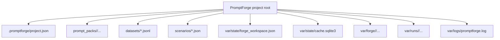
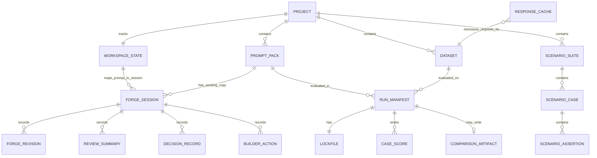
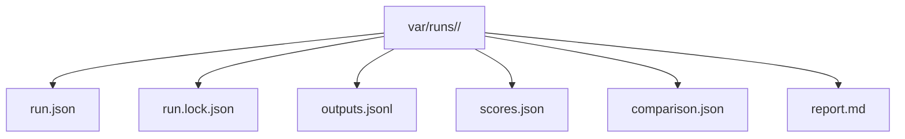

# Data Model

_Last verified against commit `4995d46a2ca16a3f56824412acc547118ed6d804`._

PromptForge has no central database schema. Its data model is split across:

- typed in-memory contracts in Pydantic models
- project files and prompt-pack files
- local artifact directories
- one SQLite cache table

This document maps those pieces to the code and calls out the compatibility
edges that matter in production use.

## Core Entities

| Entity | Source | Persisted as | Purpose |
|---|---|---|---|
| `ProjectMetadata` | `src/promptforge/project.py` | `.promptforge/project.json` | Project defaults, provider/model choices, dataset defaults, last opened prompt |
| `PromptPackManifest` | `src/promptforge/core/models.py` | `prompt_packs/<version>/manifest.yaml` | Prompt version, display name, description, output format, required sections |
| `PromptBrief` | `src/promptforge/prompts/brief.py` | `prompt_packs/<version>/prompt.json` | Prompt authoring metadata used by the app and forge workspace |
| `PromptPack` | `src/promptforge/core/models.py` | loaded from prompt-pack files | Fully loaded prompt, schema, and content hash |
| `DatasetCase` | `src/promptforge/core/models.py` | one JSONL line | Runtime evaluation case with `input`, optional `context`, rubric targets, and expectations |
| `ScenarioSuite` | `src/promptforge/scenarios/models.py` | `scenarios/<suite_id>.json` | Saved case set used for review-style testing |
| `WorkspaceState` | `src/promptforge/forge/workspace.py` | `var/state/forge_workspace.json` | Active prompt and prompt-to-session mapping |
| `ForgeSessionManifest` | `src/promptforge/forge/models.py` | `var/forge/<session_id>/session.json` | Session identity, working and baseline dirs, dataset paths, model/provider config |
| `ForgeHistory` | `src/promptforge/forge/models.py` | `var/forge/<session_id>/history.json` | Revisions, benchmarks, reviews, decisions, builder actions, playground runs |
| `PreparedAgentEdit` | `src/promptforge/forge/models.py` | `var/forge/<session_id>/pending_edits.json` | Staged proposal waiting for apply or discard |
| `RunManifest` | `src/promptforge/core/models.py` | `var/runs/<run_id>/run.json` | Identity of an evaluation or comparison run |
| `Lockfile` | `src/promptforge/core/models.py` | `var/runs/<run_id>/run.lock.json` | Reproducibility metadata: hashes, config, versions, provider choice |
| `ScoresArtifact` | `src/promptforge/core/models.py` | `var/runs/<run_id>/scores.json` | Per-case and aggregate evaluation scores |
| `ComparisonArtifact` | `src/promptforge/core/models.py` | `var/runs/<run_id>/comparison.json` | Head-to-head comparison results |
| `CachedResponse` | `src/promptforge/core/models.py` | `response_cache.response_json` | Serialized successful generation result |

## Persistent Layout

## Relationship Diagram

## Prompt-Pack Model

Required runtime files:

- `manifest.yaml`
- `system.md`
- `user_template.md`
- `variables.schema.json`

PromptForge also uses:

- `prompt.json`

`PromptBrief` currently contains:

- `purpose`
- `expected_behavior`
- `success_criteria`
- `baseline_prompt_ref`
- `primary_scenario_suites`
- `owner`
- `audience`
- `release_notes`
- `builder_agent_model`
- `builder_permission_mode`
- `research_policy`
- `prompt_blocks`

Important note:

- `prompt_blocks` is still persisted and loaded for compatibility even though the current app centers on full-file editing rather than a prompt-canvas UI.

Sources:

- [src/promptforge/prompts/loader.py](../src/promptforge/prompts/loader.py)
- [src/promptforge/prompts/brief.py](../src/promptforge/prompts/brief.py)
- [src/promptforge/forge/workspace.py](../src/promptforge/forge/workspace.py)

## Dataset Model

Datasets are newline-delimited JSON.

Each line becomes a `DatasetCase` with:

- `id`
- `input`
- optional `context`
- optional `rubric_targets`
- optional `format_expectations`

If `id` is missing, the loader synthesizes `line-0001`, `line-0002`, and so on.

Inputs are validated against the active prompt pack's `variables.schema.json`
before provider execution starts.

Sources:

- [src/promptforge/datasets/loader.py](../src/promptforge/datasets/loader.py)
- [src/promptforge/core/models.py](../src/promptforge/core/models.py)

## Scenario And Review Model

`ScenarioSuite` is the saved case-set contract for review runs.

Each suite contains:

- suite metadata: `suite_id`, `name`, `description`, `linked_prompts`
- `cases`

Each case contains:

- `case_id`
- `title`
- `input`
- optional `context`
- optional `rubric_targets`
- optional `format_expectations`
- `assertions`
- `tags`
- `notes`

Supported assertion kinds:

- `required_string`
- `forbidden_string`
- `required_section`
- `max_words`
- `trait_minimum`
- `max_latency_ms`
- `max_total_tokens`

Sources:

- [src/promptforge/scenarios/models.py](../src/promptforge/scenarios/models.py)
- [src/promptforge/scenarios/service.py](../src/promptforge/scenarios/service.py)
- [src/promptforge/forge/service.py](../src/promptforge/forge/service.py)

## Forge Session Model

Each prompt session lives under `var/forge/<session_id>/`.

Key files:

| File | Meaning |
|---|---|
| `session.json` | session manifest and static session configuration |
| `history.json` | revisions, benchmark summaries, reviews, decisions, builder actions, playground runs |
| `pending_edits.json` | staged proposals waiting for apply or discard |
| `chat_history.json` | persisted agent chat history |

The session also keeps:

- a baseline prompt snapshot
- a working prompt directory
- revision snapshots
- proposal staging directories

The app can view a prompt without creating a session. Session creation is lazy.

Sources:

- [src/promptforge/forge/models.py](../src/promptforge/forge/models.py)
- [src/promptforge/forge/service.py](../src/promptforge/forge/service.py)
- [src/promptforge/forge/workspace.py](../src/promptforge/forge/workspace.py)

## Run Artifact Model

Every run directory under `var/runs/<run_id>/` contains:

Two run kinds exist:

- `evaluation`
- `comparison`

Important shape difference:

- for evaluation runs, `scores.json` is one `ScoresArtifact`
- for comparison runs, `scores.json` is an object with `prompt_a` and `prompt_b` evaluation artifacts

`comparison.json` is:

- a placeholder object for evaluation runs
- a full `ComparisonArtifact` for comparison runs

Sources:

- [src/promptforge/runtime/artifacts.py](../src/promptforge/runtime/artifacts.py)
- [src/promptforge/runtime/run_service.py](../src/promptforge/runtime/run_service.py)
- [src/promptforge/runtime/report_service.py](../src/promptforge/runtime/report_service.py)

## SQLite Cache

`var/state/cache.sqlite3` contains one table: `response_cache`.

| Column | Meaning |
|---|---|
| `cache_key` | primary key derived from prompt version, case ID, model, and config hash |
| `prompt_version` | prompt pack version |
| `case_id` | dataset case ID |
| `model` | generation model |
| `config_hash` | stable hash of prompt pack, dataset, provider, and config |
| `response_json` | serialized `CachedResponse` |
| `created_at` | UTC timestamp |

This cache stores successful generation results, not full dataset rows.

Source:

- [src/promptforge/runtime/cache.py](../src/promptforge/runtime/cache.py)

## Versioning And Compatibility Notes

### Prompt packs

- `apiVersion` is loaded and preserved from `manifest.yaml`.
- Current runtime behavior does not branch on `apiVersion`.
- Opening an older prompt pack can auto-create a default `prompt.json`.

### Forge sessions

- session creation is lazy
- session restoration checks config compatibility before reuse
- invalid or stale session mappings are removed from `forge_workspace.json` when detected

### Cache

- there is no migration framework for `cache.sqlite3`
- if cache correctness is in doubt, delete the database and rerun

### Artifacts

- `run.lock.json` is the closest thing to a reproducibility contract
- report rebuilds depend on saved `scores.json` or `comparison.json`; they do not rerun models

### Project root assumptions

- the helper and forge workspace currently resolve several paths relative to the active project cwd
- each helper process therefore owns exactly one project root at a time
