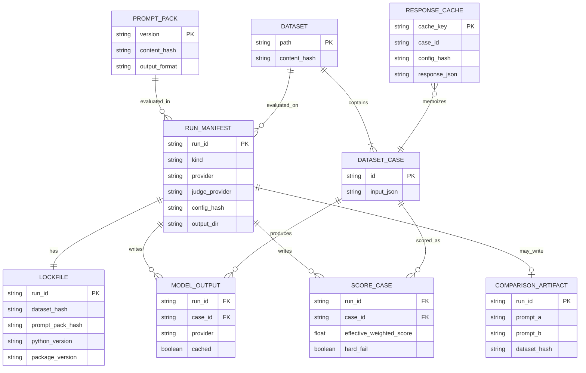
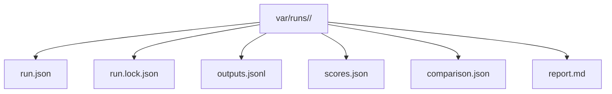

# Data Model

_Last verified against commit `bf2bd3481eb50f6507094ec0e49bb6567bcab348`._

PromptForge has two kinds of data model:

- in-memory contracts defined with Pydantic
- persisted local state written as JSON, JSONL, Markdown, and SQLite rows

There is no migration framework or central relational database in v1.

## Core entities

| Entity | Source | Purpose |
|---|---|---|
| `PromptPackManifest` | `src/promptforge/core/models.py` | Names a prompt pack, its output format, and required sections |
| `PromptPack` | `src/promptforge/core/models.py` | Fully loaded prompt pack, including prompts, schema, and content hash |
| `DatasetCase` | `src/promptforge/core/models.py` | One JSONL evaluation case with input, optional context, rubric targets, and format expectations |
| `RunConfig` | `src/promptforge/core/models.py` | Execution controls such as concurrency, retries, timeout, and failure threshold |
| `ScoringConfig` | `src/promptforge/core/models.py` | Rubric weights, hard-fail rules, judge model, and tie margin |
| `ModelExecutionResult` | `src/promptforge/core/models.py` | One case result from generation, including caching status, latency, and provider |
| `CaseScore` | `src/promptforge/core/models.py` | One scored case with rule checks, trait scores, and hard-fail status |
| `ScoresArtifact` | `src/promptforge/core/models.py` | Evaluation summary plus all per-case scores |
| `ComparisonArtifact` | `src/promptforge/core/models.py` | Head-to-head comparison between prompt A and prompt B |
| `Lockfile` | `src/promptforge/core/models.py` | Reproducibility record with hashes, config, Python version, and package version |
| `CachedResponse` | `src/promptforge/core/models.py` | Local memoized generation output stored in SQLite |

## Persisted state

### Filesystem artifacts

Each run creates a directory under `var/runs/<run_id>/`.

| File | Written by | Meaning |
|---|---|---|
| `run.json` | `ArtifactStore.write_manifest()` | Run manifest and high-level metadata |
| `run.lock.json` | `EvaluationService.run()` / `compare()` | Reproducibility record with hashes and config |
| `outputs.jsonl` | `EvaluationService.run()` / `compare()` | Raw model outputs; compare runs contain paired `a` and `b` rows |
| `scores.json` | `EvaluationService.run()` / `compare()` | Evaluation runs store one `ScoresArtifact`; comparison runs store `{prompt_a, prompt_b}` |
| `comparison.json` | `EvaluationService.run()` / `compare()` | Placeholder for single runs, full `ComparisonArtifact` for compare runs |
| `report.md` | `render_evaluation_report()` / `render_comparison_report()` | Human-readable summary |

### SQLite cache

`var/state/cache.sqlite3` contains a single table: `response_cache`.

| Column | Meaning |
|---|---|
| `cache_key` | Primary key derived from prompt version, case ID, model, and config hash |
| `prompt_version` | Prompt pack version |
| `case_id` | Dataset case ID |
| `model` | Generation model |
| `config_hash` | Stable hash of prompt pack, dataset, provider choice, and configs |
| `response_json` | Serialized `CachedResponse` payload |
| `created_at` | UTC timestamp |

## Entity relationships

## Run directory structure

## Versioning and migration notes

### Prompt packs

- Prompt packs include `apiVersion`, `version`, `name`, `output_format`, and `required_sections`.
- `apiVersion` is loaded and stored, but current runtime logic does not branch on it. Treat it as metadata today.
- Prompt pack changes affect the `prompt_pack_hash`, which feeds the `config_hash`, which invalidates cache reuse automatically.

### Datasets

- Datasets are plain JSONL files.
- Case IDs are optional in source files; the loader will synthesize `line-0001`, `line-0002`, and so on if missing.
- Any dataset content change changes `dataset_hash`, which also invalidates cache reuse.

### Cache schema

- The SQLite table is created lazily inside `ResponseCache.__init__()`.
- There is no migration framework.
- If cache schema changes or the cache becomes suspect, delete `var/state/cache.sqlite3` and rerun.

### Artifact schemas

- Evaluation `scores.json` matches `ScoresArtifact`.
- Comparison `scores.json` is intentionally different: it is a JSON object with `prompt_a` and `prompt_b` keys, each containing a full evaluation artifact.
- `run.lock.json` is the closest thing to a stable reproducibility contract. It records package version, Python version, provider choice, hashes, and effective configs.

## Source of truth

- [`../src/promptforge/core/models.py`](../src/promptforge/core/models.py)
- [`../src/promptforge/runtime/artifacts.py`](../src/promptforge/runtime/artifacts.py)
- [`../src/promptforge/runtime/cache.py`](../src/promptforge/runtime/cache.py)
- [`../src/promptforge/runtime/run_service.py`](../src/promptforge/runtime/run_service.py)

