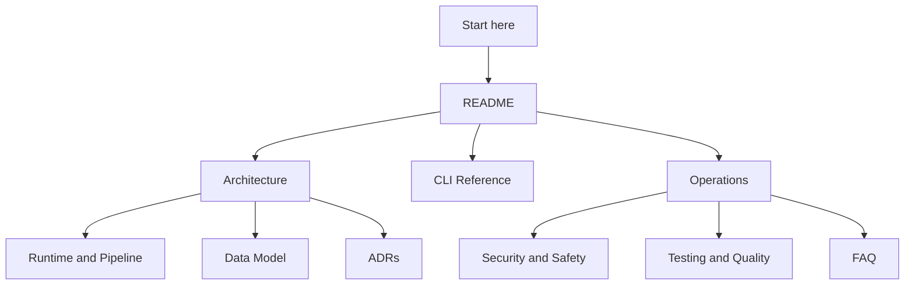

# Documentation Index

_Last verified against commit `065f5120dee568fe5b33c7565e7d62942d325db0`._

This documentation set is organized for three audiences:

- Developers who need to modify prompt packs, prompt-workspace behavior, scoring, providers, or CLI behavior
- Operators who need to run, diagnose, and recover the system safely across the app and CLI surfaces
- Stakeholders who need to understand value, boundaries, and outputs

## Recommended reading paths

### New engineer

1. [README](../README.md)
2. [Architecture](architecture.md)
3. [Runtime and pipeline](runtime-and-pipeline.md)
4. [CLI reference](cli-reference.md)
5. [Testing and quality](testing-and-quality.md)

### Operator

1. [README](../README.md)
2. [CLI reference](cli-reference.md)
3. [Operations](operations.md)
4. [Security and safety](security-and-safety.md)
5. [FAQ](faq.md)

### Non-technical stakeholder

1. [README](../README.md)
2. [Architecture](architecture.md)
3. [Eval philosophy](eval-philosophy.md)
4. [FAQ](faq.md)

## Core docs

| Document | Purpose |
|---|---|
| [Architecture](architecture.md) | System overview, module responsibilities, runtime boundaries |
| [Data model](data-model.md) | Core entities, persisted files, cache table, versioning notes |
| [Runtime and pipeline](runtime-and-pipeline.md) | Stage-by-stage execution flow, retries, failure points, checkpoints |
| [CLI reference](cli-reference.md) | Commands, flags, examples, and troubleshooting by command |
| [Operations](operations.md) | Day-1 setup, day-2 operations, incident response, recovery |
| [Security and safety](security-and-safety.md) | Auth paths, secrets handling, trust boundaries, safe defaults |
| [Testing and quality](testing-and-quality.md) | Test strategy, coverage, gaps, release checklist |
| [FAQ](faq.md) | Short operational and developer answers |
| [Eval philosophy](eval-philosophy.md) | Why PromptForge combines hard rules with rubric judging |

## ADRs

See the [ADR index](adr/README.md) for context and document status.

| ADR | Decision |
|---|---|
| [ADR-0001](adr/0001-cli-first-artifact-driven-runtime.md) | Historical v1 CLI-first runtime decision |
| [ADR-0002](adr/0002-multi-provider-gateway.md) | Separate generation and judge providers behind a gateway |
| [ADR-0003](adr/0003-filesystem-artifacts-plus-sqlite-cache.md) | Persist outputs on disk and cache responses in SQLite |
| [ADR-0004](adr/0004-schema-first-evaluation-contract.md) | Treat prompt packs, datasets, and artifacts as schema-first contracts |
| [ADR-0005](adr/0005-compare-builds-on-full-child-runs.md) | Materialize two full evaluation runs before comparing them |
| [ADR-0006](adr/0006-macos-app-helper-and-prompt-workspace.md) | Make the macOS app and local helper the primary interactive prompt-workspace surface |

## Source-of-truth code paths

- [`src/promptforge/cli.py`](../src/promptforge/cli.py)
- [`src/promptforge/setup_wizard.py`](../src/promptforge/setup_wizard.py)
- [`src/promptforge/runtime/run_service.py`](../src/promptforge/runtime/run_service.py)
- [`src/promptforge/runtime/gateway.py`](../src/promptforge/runtime/gateway.py)
- [`src/promptforge/core/models.py`](../src/promptforge/core/models.py)
