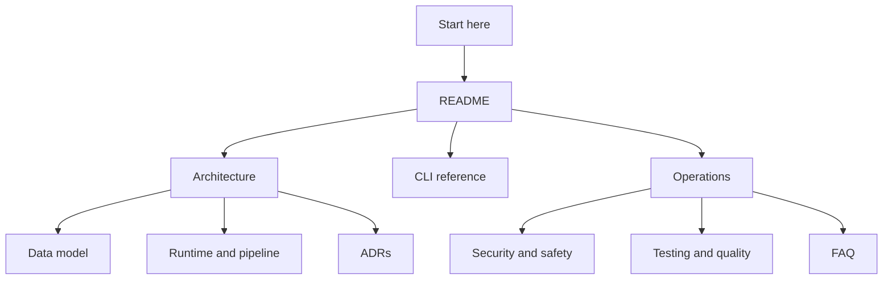

# Documentation Index

_Last verified against commit `4995d46a2ca16a3f56824412acc547118ed6d804`._

This documentation set is organized for three audiences:

- developers changing prompt packs, runtime behavior, helper RPCs, or the macOS app
- operators running, diagnosing, and recovering PromptForge locally
- stakeholders who need a clear explanation of value, limits, and evidence

## Recommended Reading Paths

### New engineer

1. [README](../README.md)
2. [Architecture](architecture.md)
3. [Data model](data-model.md)
4. [Runtime and pipeline](runtime-and-pipeline.md)
5. [Testing and quality](testing-and-quality.md)

### Operator

1. [README](../README.md)
2. [CLI reference](cli-reference.md)
3. [Operations](operations.md)
4. [Security and safety](security-and-safety.md)
5. [FAQ](faq.md)

### Non-technical stakeholder

1. [README](../README.md)
2. [Architecture](architecture.md)
3. [Runtime and pipeline](runtime-and-pipeline.md)
4. [Security and safety](security-and-safety.md)
5. [FAQ](faq.md)

## Core Documents

| Document | Purpose |
|---|---|
| [Architecture](architecture.md) | System shape, boundaries, responsibilities, and component interaction |
| [Data model](data-model.md) | Project files, prompt packs, runs, reviews, cache rows, and compatibility notes |
| [Runtime and pipeline](runtime-and-pipeline.md) | End-to-end execution stages, retries, checkpoints, and failures |
| [CLI reference](cli-reference.md) | Commands, flags, recipes, and troubleshooting |
| [Operations](operations.md) | Setup, routine operation, monitoring, incident response, and recovery |
| [Security and safety](security-and-safety.md) | Auth paths, trust boundaries, data handling, and safe defaults |
| [Testing and quality](testing-and-quality.md) | Test strategy, coverage, gaps, and release checklist |
| [FAQ](faq.md) | Short answers to real operator and developer questions |
| [ADR index](adr/README.md) | Key decisions and tradeoffs visible in the current code |

## Coverage Map

These docs are grounded in the following code paths:

| Area | Modules |
|---|---|
| CLI and onboarding | `src/promptforge/cli.py`, `src/promptforge/setup_wizard.py` |
| Core settings and contracts | `src/promptforge/core/config.py`, `src/promptforge/core/models.py`, `src/promptforge/core/logging.py` |
| Prompt and dataset loading | `src/promptforge/prompts/*`, `src/promptforge/datasets/loader.py` |
| Runtime execution | `src/promptforge/runtime/*`, `src/promptforge/scoring/*` |
| Forge workspace | `src/promptforge/forge/*`, `src/promptforge/project.py`, `src/promptforge/scenarios/*` |
| App/helper boundary | `src/promptforge/helper/server.py`, `apps/macos/PromptForge/PromptForge/*.swift` |
| Test harness | `tests/*`, `apps/macos/PromptForge/PromptForgeTests/PromptForgeTests.swift` |

## ADRs

PromptForge already records the main architecture decisions.

| ADR | Decision |
|---|---|
| [ADR-0001](adr/0001-cli-first-artifact-driven-runtime.md) | CLI-first, artifact-driven runtime origin |
| [ADR-0002](adr/0002-multi-provider-gateway.md) | Multi-provider gateway for generation and judging |
| [ADR-0003](adr/0003-filesystem-artifacts-plus-sqlite-cache.md) | Filesystem artifacts plus SQLite response cache |
| [ADR-0004](adr/0004-schema-first-evaluation-contract.md) | Schema-first prompt, dataset, and artifact contracts |
| [ADR-0005](adr/0005-compare-builds-on-full-child-runs.md) | Compare via two full child runs plus one comparison run |
| [ADR-0006](adr/0006-macos-app-helper-and-prompt-workspace.md) | macOS app, local helper, and forge workspace as the interactive surface |

## Notes On Scope

- These docs describe the code as it exists today.
- They do not assume a hosted service, a remote database, or a multi-user control plane.
- Where behavior is still transitional, such as compatibility support for legacy `prompt_blocks`, the docs call that out explicitly instead of hiding it.
