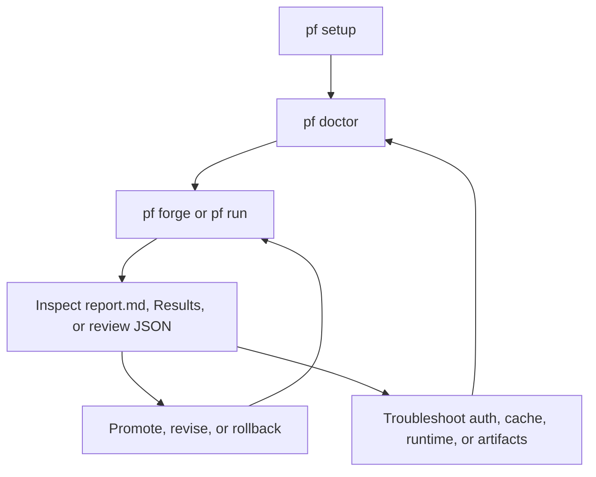
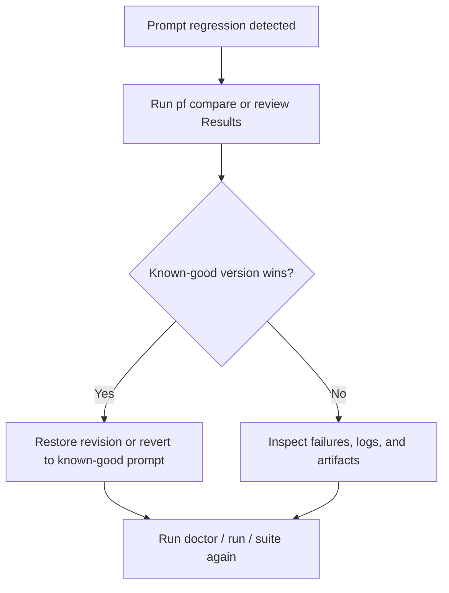

# Operations

_Last verified against commit `4995d46a2ca16a3f56824412acc547118ed6d804`._

PromptForge is operated locally. There is no remote control plane to diagnose.

Your operational surface is:

- `.env` and provider defaults
- `pf setup`, `pf status`, and `pf doctor`
- `PromptForge.app` and its local helper
- `var/runs/` for batch artifacts
- `var/forge/` for prompt sessions, revisions, reviews, and decisions
- `var/state/cache.sqlite3` for generation cache
- `var/logs/promptforge.log` for structured logs

## Day-1 Setup

### 1. Bootstrap the environment

```bash
make bootstrap
. .venv/bin/activate
```

Requirements:

- Python 3.11+
- one working provider auth path
- for the macOS app, a built or installed `PromptForge.app`

### 2. Initialize auth and defaults

```bash
pf setup
```

The wizard can:

- create `.env` from `.env.example`
- choose default provider and judge provider
- choose generation and judge models
- collect OpenAI or OpenRouter keys
- inspect or launch Codex login
- run `pf doctor`

### 3. Validate before using the repo

```bash
pf doctor
pf status
```

Proceed only when:

- prompt pack resolution works
- dataset resolution works
- provider auth is ready
- model access returns `PF_OK`

## First Project Bring-Up

If you start with an empty folder:

```bash
mkdir my-prompt-project
cd my-prompt-project
pf status
pf prompts create --prompt draft-v1 --name "Draft v1"
pf forge
```

Important:

- empty projects are supported in the app
- the first app open can show a no-prompts workspace instead of failing
- create or import a prompt pack from the app when needed

## Day-2 Routine Operations

### Run one evaluation

```bash
pf run --prompt v1 --dataset datasets/core.jsonl
```

### Compare two prompt versions

```bash
pf compare --a v1 --b v2 --dataset datasets/core.jsonl
```

### Inspect or rebuild a report

```bash
pf report --run <run_id>
```

### Work interactively

```bash
pf forge
```

Operational behavior in the app:

- prompt open is cheap
- forge sessions are created lazily
- `Check Prompt`, `Run Cases`, and `Try Input` are explicit actions
- provider connection checks in the app are refreshed on demand from Settings

## App Build And Packaging Notes

For source builds, the Xcode app target currently bundles a Python engine by
copying:

- `src/`
- `datasets/`
- `.venv/`

into the app resources through:

- [packaging/macos/bundle_engine.sh](../packaging/macos/bundle_engine.sh)

Operational implication:

- before building the app, make sure the local `.venv` is complete and healthy
- if the app reports a missing or corrupt bundled runtime, rebuild the app after rebuilding the local engine environment

## Operator Loop



## Monitoring And Status Checks

### Routine checks

| Check | Command or file | What to look for |
|---|---|---|
| Environment health | `pf doctor` | auth readiness, prompt and dataset resolution, model access |
| Project defaults | `pf status` | provider, judge provider, model, active prompt |
| App connection state | Settings -> refresh connections | cached vs refreshed provider readiness |
| Recent runs | `ls -lt var/runs` | expected run IDs and timestamps |
| Recent forge sessions | `ls -lt var/forge` | expected session IDs and recent writes |
| Logs | `tail -f var/logs/promptforge.log` | `run_started`, `case_executed`, `run_completed` |
| Cache schema | `sqlite3 var/state/cache.sqlite3 '.schema response_cache'` | table exists and is readable |
| Reproducibility | `var/runs/<run_id>/run.lock.json` | intended model, provider, hashes, package version |

### What exists today

- structured JSON file logs
- local artifact directories
- local cache database
- app helper event stream

### What does not exist today

- no metrics endpoint
- no centralized dashboard
- no log rotation
- no remote health API

## Incident Response

### Symptom: provider auth is broken

Actions:

1. run `pf doctor`
2. rerun `pf setup`
3. verify the chosen provider and model
4. if using the app, open Settings and refresh connections

### Symptom: `pf forge` cannot open or helper will not start

Actions:

1. verify that `PromptForge.app` exists
2. if launching from source, rebuild the app after rebuilding `.venv`
3. inspect the app error for missing bundled runtime
4. for debug runs, confirm `--engine-root` or saved engine root still points to a valid runtime

### Symptom: a run created `run.json` but not the rest of the files

Actions:

1. inspect `var/runs/<run_id>/`
2. read `run.lock.json`
3. inspect `var/logs/promptforge.log`
4. rerun the same command

Recovery note:

- successful generations may already be cached, so the rerun can still be faster than the first attempt

### Symptom: results look stale or suspicious

Actions:

1. inspect `run.lock.json`
2. confirm prompt pack hash and dataset hash
3. delete `var/state/cache.sqlite3` if cache reuse is no longer trusted
4. rerun

### Symptom: app prompt history or review state looks wrong

Actions:

1. inspect `var/state/forge_workspace.json`
2. inspect the relevant `var/forge/<session_id>/session.json` and `history.json`
3. use revision restore or baseline promotion inside the app or helper-backed flows

PromptForge now validates staged edits before swapping them into the working
copy, so malformed staged changes should not corrupt the live prompt.

### Symptom: `Run Cases` or review feels slow

Actions:

1. check provider choice; Codex can feel slower than direct API calls
2. remember that the first real action on a prompt may create the forge session
3. inspect logs for provider timeouts or repeated retries

## Rollback And Recovery

There is no global rollback command because PromptForge is file-backed and local.

Your recovery tools are:

- prompt version comparison with `pf compare`
- forge revision restore
- baseline promotion
- Git history
- cache invalidation

### Recovery playbook after a bad prompt change

1. identify the last known-good prompt version or Git commit
2. compare the candidate against that baseline
3. inspect hard-fails, not just average score
4. restore or promote as needed
5. keep using the known-good version until the candidate passes



## Safe Cleanup

Safe to delete when you understand the consequences:

- old run directories under `var/runs/`
- `var/state/cache.sqlite3` to force uncached reruns
- `var/logs/promptforge.log` after archiving if needed
- stale forge session directories under `var/forge/` if you intentionally want to discard local workspace history

Do not delete casually:

- `.promptforge/project.json`
- active prompt packs
- datasets
- scenarios

## Operator Checklist

- [ ] `pf doctor` passes
- [ ] correct provider and model are selected
- [ ] current prompt and dataset are the ones you intended
- [ ] run artifacts exist and include `run.lock.json`
- [ ] review evidence is readable enough for stakeholders
- [ ] secrets are not being copied into reports or logs

## Source Of Truth

- [src/promptforge/cli.py](../src/promptforge/cli.py)
- [src/promptforge/setup_wizard.py](../src/promptforge/setup_wizard.py)
- [src/promptforge/helper/server.py](../src/promptforge/helper/server.py)
- [src/promptforge/forge/workspace.py](../src/promptforge/forge/workspace.py)
- [src/promptforge/forge/service.py](../src/promptforge/forge/service.py)
- [src/promptforge/core/logging.py](../src/promptforge/core/logging.py)
- [apps/macos/PromptForge/PromptForge/Item.swift](../apps/macos/PromptForge/PromptForge/Item.swift)
- [packaging/macos/bundle_engine.sh](../packaging/macos/bundle_engine.sh)
