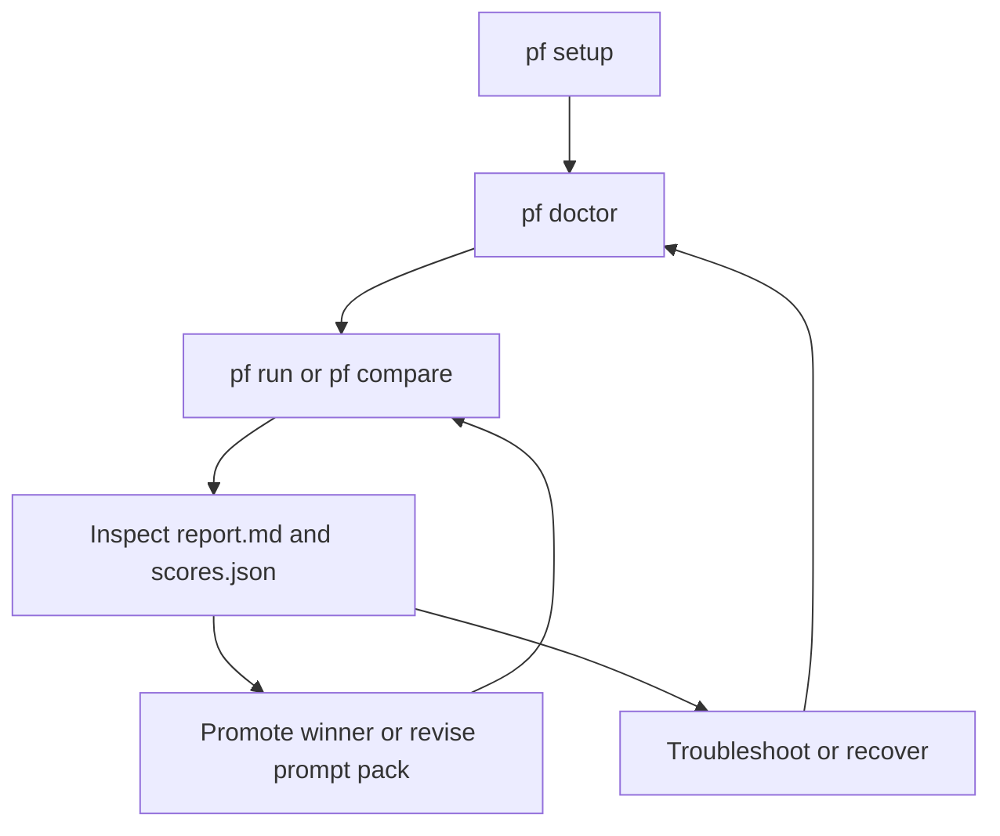

# Operations

_Last verified against commit `065f5120dee568fe5b33c7565e7d62942d325db0`._

PromptForge is simple to operate because it is a local macOS app plus local CLI
and helper processes with local artifacts. There is no remote service tier and
no external database to repair.

The operational surface is:

- `.env` for auth and defaults
- macOS Keychain for app-managed OpenAI/OpenRouter API keys
- `pf setup` and `pf doctor`
- `PromptForge.app` plus its local helper for interactive work
- `var/runs/` for run outputs
- `var/forge/` for prompt workspace sessions, revisions, pending edits, and chat history
- `var/state/cache.sqlite3` for cached model outputs
- `var/logs/promptforge.log` for structured lifecycle logs

## Day-1 setup

### 1. Prepare the environment

```bash
make bootstrap
. .venv/bin/activate
```

Requirements:

- Python 3.11+
- one provider auth path:
  - `OPENAI_API_KEY`, or
  - `OPENROUTER_API_KEY`, or
  - successful `codex login`

### 2. Run onboarding

```bash
pf setup
```

The wizard will:

- create `.env` if needed
- configure provider defaults
- prompt for API keys where required
- help establish Codex login

### 3. Validate the workstation

```bash
pf doctor
```

Proceed only when:

- prompt pack resolution is ready
- dataset resolution is ready
- provider auth is ready
- model access returns `PF_OK`

## Day-2 operations

### Run a single evaluation

```bash
pf run --prompt v1 --dataset datasets/core.jsonl
```

### Compare two versions

```bash
pf compare --a v1 --b v2 --dataset datasets/core.jsonl
```

### Inspect the result

- read `report.md` for a human summary
- read `scores.json` for machine-readable detail
- read `run.lock.json` for reproducibility data

### Work interactively in the app

```bash
pf forge
```

Operational notes for the app flow:

- Opening a prompt does not auto-create a forge session or auto-run a benchmark.
- The first agent chat, staged edit, save into a working session, or explicit benchmark/evaluation creates the prompt session lazily.
- Benchmark history in the app is prompt-scoped. Empty history on a newly opened prompt is expected until you explicitly run `Run Bench` or `Full Eval`.

### Rebuild a report

```bash
pf report --run <run_id>
```

## Operator loop



## Monitoring, logging, and status checks

### What exists today

- structured JSON logs in `var/logs/promptforge.log`
- CLI exit codes
- run directories under `var/runs/`
- cache state in `var/state/cache.sqlite3`

### What does not exist today

- no metrics endpoint
- no log rotation
- no dashboard
- no background job status service

### Routine status checks

| Check | Command or file | What to look for |
|---|---|---|
| Environment health | `pf doctor` | broken auth, missing dataset, bad prompt pack path |
| App auth state | PromptForge settings UI | provider connected state, Keychain-loaded keys, Codex login state |
| Recent run history | `ls var/runs` | expected run IDs and timestamps |
| Recent forge sessions | `ls var/forge` | expected session IDs, pending edit state, chat history |
| Structured logs | `tail -f var/logs/promptforge.log` | `run_started`, `case_executed`, `run_completed` |
| Cache state | `sqlite3 var/state/cache.sqlite3 '.schema response_cache'` | table exists and is queryable |
| Reproducibility | `var/runs/<run_id>/run.lock.json` | expected hashes, package version, provider settings |

## Incident response

### Symptom: provider auth is broken

Actions:

1. Run `pf doctor`
2. Rerun `pf setup`
3. Verify the correct provider is selected in `.env`
4. Retry with a known-good model name for that provider

### Symptom: a run exits before all artifacts exist

This can happen if an exception escapes before the final persistence phase.

Actions:

1. Inspect `var/runs/<run_id>/`
2. Check whether `run.json` and `run.lock.json` exist
3. Check `var/logs/promptforge.log`
4. Rerun the same command

Recovery note:

- successful uncached generations may already be in `var/state/cache.sqlite3`, so reruns may be cheaper even if the run directory is incomplete

### Symptom: suspicious or stale results

Actions:

1. Inspect `run.lock.json` for provider, model, and config hash
2. Confirm the prompt pack and dataset hashes are the expected ones
3. If cache reuse is no longer trusted, delete `var/state/cache.sqlite3`
4. Rerun the command

### Symptom: app chat feels slow

Actions:

1. Confirm you are not using a cold `codex` provider path if low-latency chat matters
2. Open the prompt once and send a second message; the first agent interaction still pays forge-session startup cost
3. Avoid assuming prompt open should populate benchmark history; benchmarks are now explicit actions
4. If the delay is still extreme, inspect `var/logs/promptforge.log` and helper stderr for provider startup issues

### Symptom: compare output is confusing

Actions:

1. Open the comparison run directory
2. Read `comparison.json`
3. Read both child evaluation artifacts referenced in `run.json.notes`
4. Validate whether hard-fails, not score deltas, drove the winner

## Rollback and recovery

There is no dedicated rollback command. Rollback is operationally simple because
PromptForge does not mutate datasets or remote state.

Rollback options:

- rerun a known-good prompt pack version
- compare the current candidate against the last known-good version
- restore a previous Git commit containing the prompt pack you trust

Recovery steps after a bad prompt change:

1. identify the last known-good prompt pack version or commit
2. run `pf compare --a <known-good> --b <candidate> --dataset ...`
3. confirm the older version wins or avoids hard-fails
4. keep routing work through the known-good prompt pack

## Cleanup tasks

### Safe to remove

- old run directories under `var/runs/`
- `var/state/cache.sqlite3` if you want to force uncached reruns
- `var/logs/promptforge.log` if you have archived it elsewhere

### Recreated automatically

- `var/logs/`
- `var/state/`
- `var/runs/`
- `response_cache` table inside `cache.sqlite3`

## Operational boundaries

- PromptForge is designed for local or CI-style execution, not shared multi-user service operation.
- Codex runs execute in the current working directory and use the configured sandbox; review `PF_CODEX_SANDBOX` if your operational policy is stricter than the default.
- There is no retention manager for outputs. If datasets or outputs are sensitive, operators must manage storage lifecycle explicitly.

## Source of truth

- [`../src/promptforge/cli.py`](../src/promptforge/cli.py)
- [`../src/promptforge/runtime/run_service.py`](../src/promptforge/runtime/run_service.py)
- [`../src/promptforge/runtime/artifacts.py`](../src/promptforge/runtime/artifacts.py)
- [`../src/promptforge/runtime/cache.py`](../src/promptforge/runtime/cache.py)
- [`../src/promptforge/core/logging.py`](../src/promptforge/core/logging.py)
