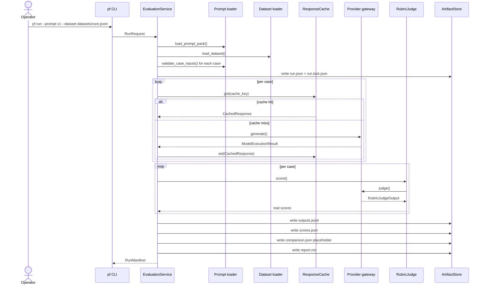
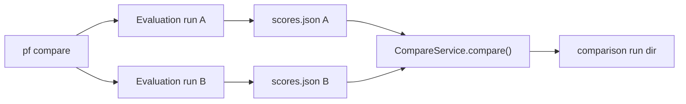
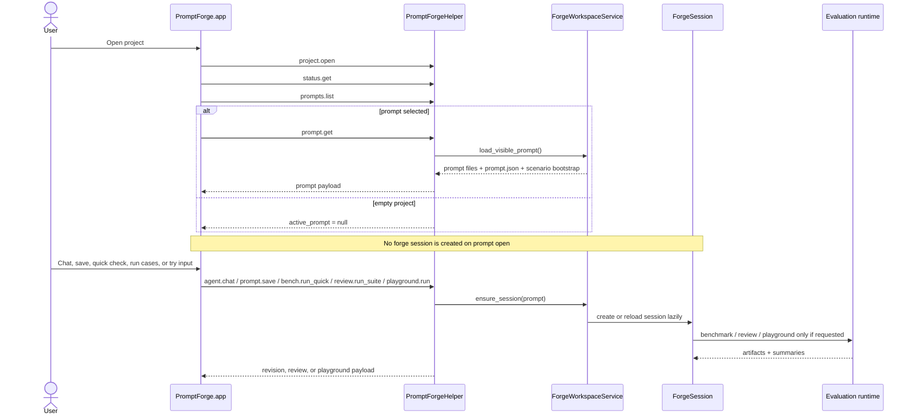
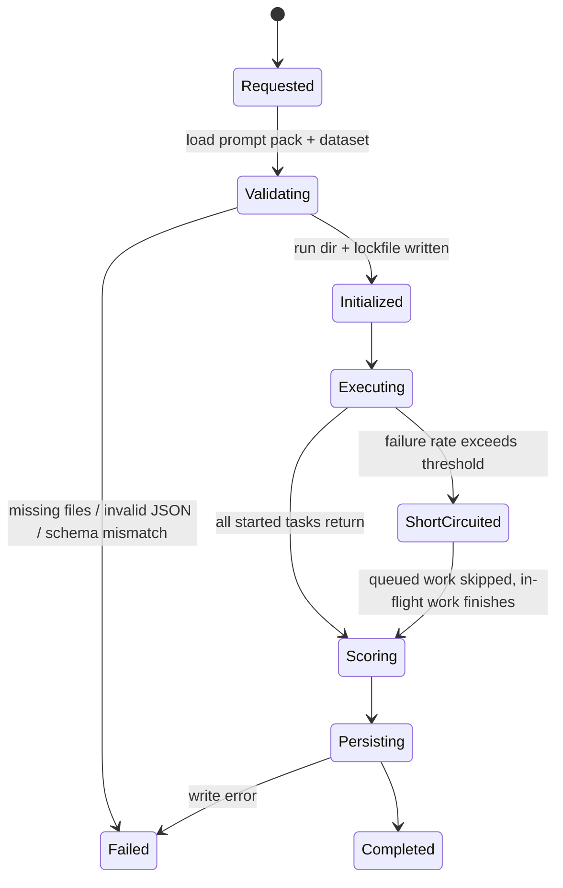

# Runtime And Pipeline

_Last verified against commit `4995d46a2ca16a3f56824412acc547118ed6d804`._

PromptForge has three execution loops:

- batch evaluation with `pf run`
- head-to-head comparison with `pf compare`
- interactive prompt work through the macOS app, local helper, and forge workspace

All three paths share the same prompt loader, dataset loader, provider gateway,
scoring rules, rubric judge, and artifact model.

## Full Evaluation Flow

## Compare Flow

`pf compare` is not an in-memory diff. It materializes two full evaluation runs,
then writes a third comparison run.

That matters operationally:

- each side of the comparison has its own artifact trail
- the comparison run stores the child run IDs in `run.json.notes`
- if comparison aggregation fails, the two child evaluation runs still exist

## Interactive App Flow

## Run Lifecycle State Machine

## Stage-By-Stage Reference

| Stage | Primary code | Inputs | Outputs | Checkpoints | Typical failures |
|---|---|---|---|---|---|
| CLI parse | `src/promptforge/cli.py` | argv, env defaults | command action or `RunRequest` | none | invalid args |
| Prompt load | `src/promptforge/prompts/loader.py` | prompt ref or path | `PromptPack` | none | missing files, invalid YAML/JSON |
| Dataset load | `src/promptforge/datasets/loader.py` | dataset path | `LoadedDataset` | none | missing file, empty dataset, bad JSONL |
| Input validation | `validate_case_inputs()` | prompt schema, `case.input` | validated cases | none | schema mismatch |
| Run init | `EvaluationService.run()` | prompt pack, dataset, config | `run.json`, `run.lock.json` | durable run ID + lockfile | filesystem errors |
| Case execution | `_execute_cases()` | rendered prompt, provider config | `ModelExecutionResult[]` | cache rows for successful uncached generations | auth failures, timeouts, provider errors |
| Soft stop | `_execute_cases()` | processed/failed counters | `stop_event` | none | failure threshold exceeded |
| Rule scoring | `evaluate_rule_checks()` | output, case expectations | `RuleCheckResult` | none | deterministic; no provider dependency |
| Rubric judging | `RubricJudge.score()` | prompt, case, output | `RubricJudgeOutput` | warnings collected | judge auth, timeout, parse errors |
| Fallback scoring | `_fallback_judge_output()` | judge exception | zero-heavy trait scores + warning | warnings in `scores.json` and `run.lock.json` | judge unavailable |
| Artifact persistence | `ArtifactStore` + `report_service.py` | outputs, scores, comparison, manifest | final run directory | `outputs.jsonl`, `scores.json`, `comparison.json`, `report.md` | filesystem errors |

## Inputs And Outputs By Stage

### Prompt loading

Reads:

- `manifest.yaml`
- `system.md`
- `user_template.md`
- `variables.schema.json`

Also reads or creates:

- `prompt.json`

Returns:

- one `PromptPack`
- one `PromptBrief`
- one content hash used in cache and lockfile identities

### Dataset loading

Reads:

- one JSONL file

Returns:

- `LoadedDataset`
- one synthesized `DatasetCase` per line
- one dataset hash used in lockfiles and cache identity

### Generation

Inputs:

- prompt version
- case ID
- system prompt
- rendered user prompt
- model/provider choice
- `RunConfig`
- config hash

Returns:

- `ModelExecutionResult`

OpenAI-compatible generation specifics:

- uses the Responses API
- sends `store=False`
- includes `prompt_cache_key` and `prompt_cache_retention`
- retries transient API errors with Tenacity
- omits `temperature` for some GPT-5 models and records a warning
- records `seed` as a warning because it is not applied in the current Responses path

Codex generation specifics:

- shells out to `codex exec`
- uses `--skip-git-repo-check`
- sets sandbox and reasoning effort from settings
- times out, terminates, and kills the subprocess if needed
- retries transient Codex failures and timeouts
- ignores `temperature` and records `seed` as informational only

### Scoring

Scoring combines:

- deterministic rule checks from `src/promptforge/scoring/rules.py`
- rubric judging from `src/promptforge/scoring/judge.py`

Outputs:

- per-case rule checks
- per-case trait scores
- hard-fail reasons
- aggregate averages and hard-fail counts

Judge failures do not abort the whole run. They produce:

- a warning in `scores.json`
- a warning in `run.lock.json`
- a fallback judge output with rule-based format score and zero-heavy other traits
- a `judge failure: ...` hard-fail reason on the affected case

## Cache, Retry, And Threshold Behavior

### Response cache

The response cache key includes:

- prompt version
- case ID
- model
- config hash

The config hash includes:

- prompt pack hash
- dataset hash
- model
- provider
- judge provider
- run config
- scoring config

That means cache reuse is invalidated automatically when meaningful prompt,
dataset, provider, or config inputs change.

### Provider retries

- OpenAI-compatible generation retries transient OpenAI/API timeout/rate-limit/internal errors
- OpenAI-compatible judging retries twice
- Codex generation retries transient Codex errors and timeouts
- Codex judging retries twice

### Failure threshold

PromptForge does not cancel all in-flight work instantly. The current behavior is:

1. count processed cases
2. count failed executions
3. if `failed / processed > failure_threshold`, set a stop flag
4. queued cases return a skipped error
5. already-running cases finish

This produces partial but inspectable runs instead of abrupt process exits.

## Checkpoints And Recovery Points

| Checkpoint | Created when | Why it matters |
|---|---|---|
| `run.json` | immediately after validation | gives the run ID and output directory even if later stages fail |
| `run.lock.json` | immediately after validation, then rewritten with warnings | preserves reproducibility context |
| cache row | after a successful uncached generation | makes reruns cheaper even after later failures |
| forge revision | after save/apply/reset/restore/promote | creates a durable rollback point for prompt work |
| review record | after scenario suite completion | keeps candidate-vs-baseline evidence locally |

## Interactive Workspace Pipeline

The interactive path layers prompt revision control on top of the runtime.

Key helper RPCs:

- `status.get`
- `settings.get`
- `connections.refresh`
- `prompts.list`
- `prompt.get`
- `prompt.save`
- `agent.chat`
- `agent.prepare_edit`
- `agent.apply_prepared_edit`
- `bench.run_quick`
- `review.run_suite`
- `playground.run`
- `review.latest`

Important behavior:

- `status.get` and `settings.get` work on empty projects
- provider connection checks for the app are cached until `connections.refresh`
- prompt open is cheap; session creation is lazy
- staged edits are validated before swap and applied through safe filesystem replacement

## Failure Modes To Expect

### Before provider calls

- prompt pack missing required files
- dataset not found or empty
- dataset input fails JSON schema validation

### During provider execution

- auth missing or invalid
- provider timeout
- transient API or Codex errors
- failure threshold short-circuit

### During scoring

- judge timeout or schema parse error
- fallback judge output reduces fidelity and hard-fails affected cases

### During persistence

- partial run directory written
- completed generations may still exist in the cache even if report writing fails

## Source Of Truth

- [src/promptforge/cli.py](../src/promptforge/cli.py)
- [src/promptforge/helper/server.py](../src/promptforge/helper/server.py)
- [src/promptforge/runtime/run_service.py](../src/promptforge/runtime/run_service.py)
- [src/promptforge/runtime/gateway.py](../src/promptforge/runtime/gateway.py)
- [src/promptforge/runtime/compare_service.py](../src/promptforge/runtime/compare_service.py)
- [src/promptforge/runtime/artifacts.py](../src/promptforge/runtime/artifacts.py)
- [src/promptforge/scoring/rules.py](../src/promptforge/scoring/rules.py)
- [src/promptforge/scoring/judge.py](../src/promptforge/scoring/judge.py)
- [src/promptforge/forge/workspace.py](../src/promptforge/forge/workspace.py)
- [src/promptforge/forge/service.py](../src/promptforge/forge/service.py)
