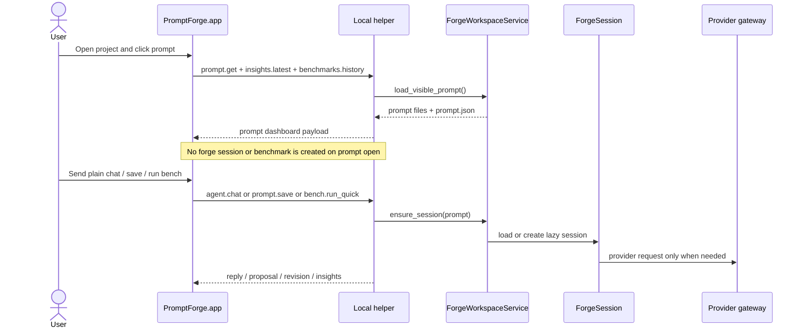
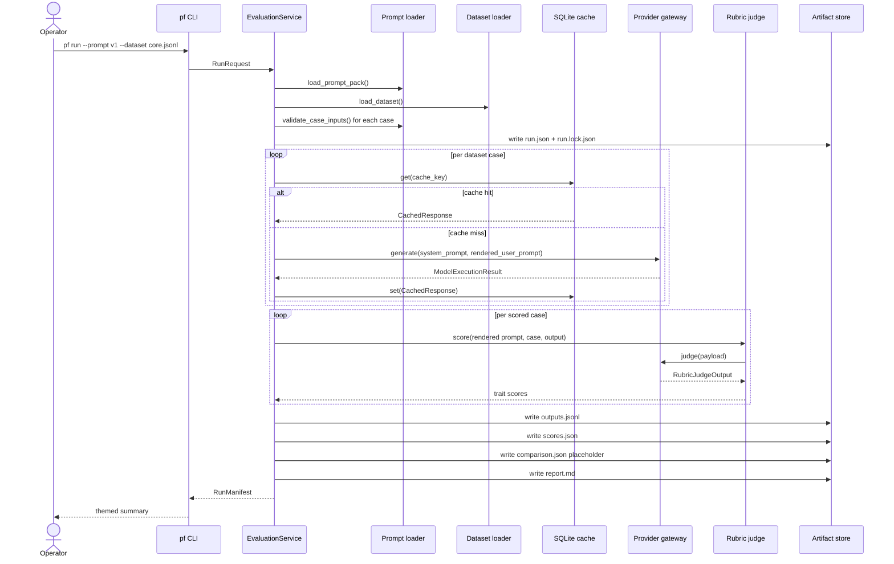
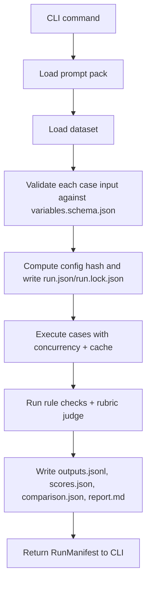
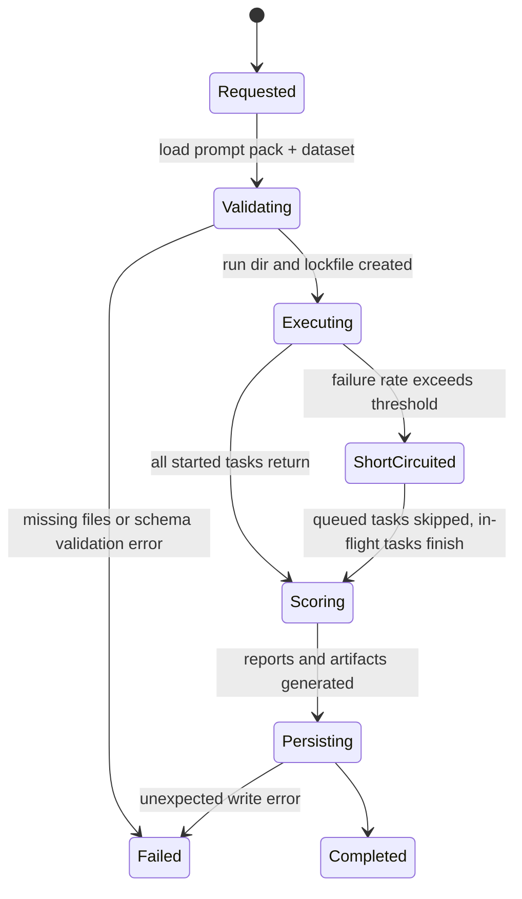

# Runtime and Pipeline

_Last verified against commit `065f5120dee568fe5b33c7565e7d62942d325db0`._

This document covers two runtime paths:

- the interactive app/helper path for prompt work
- the batch evaluation path for `pf run` and `pf compare`

It follows a single evaluation from CLI invocation to final artifacts, then
explains how the app/helper path layers prompt-workspace behavior on top.

## Interactive app pipeline at a glance

## Evaluation pipeline at a glance

## Stage-by-stage flow

## Invocation lifecycle

## Stage reference

| Stage | Primary module | Inputs | Outputs | Failure points |
|---|---|---|---|---|
| CLI parse | `src/promptforge/cli.py` | argv, env defaults | `RunRequest` or command action | invalid flags |
| Prompt load | `src/promptforge/prompts/loader.py` | prompt version or path | `PromptPack` | missing files, invalid YAML/JSON |
| Dataset load | `src/promptforge/datasets/loader.py` | dataset path | `LoadedDataset` | missing file, empty dataset, invalid JSONL |
| Input validation | `validate_case_inputs()` | prompt schema, case input | validated cases | JSON schema mismatch |
| Run initialization | `EvaluationService.run()` | validated prompt pack + dataset | `run.json`, `run.lock.json`, config hash | filesystem write issues |
| Case execution | `_execute_cases()` | prompt, case, provider, cache | `ModelExecutionResult[]` | provider auth, request errors, timeout, threshold skip |
| Rule scoring | `evaluate_rule_checks()` | output text, case expectations | `RuleCheckResult` | none; deterministic |
| Rubric judging | `RubricJudge.score()` | prompt, case, output, judge config | `RubricJudgeOutput` | provider parse errors, auth, schema errors |
| Fallback scoring | `_fallback_judge_output()` | judge exception + format score | zeroed or format-only trait scores | converts judge failure into a warning and hard fail |
| Artifact persistence | `ArtifactStore` + `report_service.py` | outputs + scores + manifest | final run directory | filesystem write issues |
| Comparison aggregation | `CompareService.compare()` | two `ScoresArtifact` values | `ComparisonArtifact` | mismatched or missing child artifacts |

## Inputs and outputs by stage

### Prompt loading

Inputs:

- `prompt_packs/<version>/manifest.yaml`
- `prompt_packs/<version>/prompt.json`
- `prompt_packs/<version>/system.md`
- `prompt_packs/<version>/user_template.md`
- `prompt_packs/<version>/variables.schema.json`

Outputs:

- `PromptPack` with `content_hash`
- strict Jinja render contract for the user prompt
- prompt intent metadata from `prompt.json`

### Interactive workspace behavior

Inputs:

- selected project root
- selected prompt pack
- optional existing forge session under `var/forge/<session_id>/`

Outputs:

- overview payload for the app without forcing a session
- lazy forge session creation on first real agent/edit/eval action
- prompt-scoped chat history, pending edits, and benchmark history once a session exists

### Dataset loading

Inputs:

- one JSONL file

Outputs:

- `LoadedDataset`
- one `DatasetCase` per line
- `content_hash` derived from the dataset file bytes

### Generation

Inputs:

- prompt pack instructions
- rendered user prompt
- `RunConfig`
- selected provider

Outputs:

- `ModelExecutionResult`
- optional cached response write

Provider specifics:

- OpenAI and OpenRouter use `AsyncOpenAI.responses.create()`
- Codex uses `codex exec` with a read-only sandbox by default
- OpenAI-compatible requests always set `store=False`
- Codex generation ignores `temperature` and cannot apply `seed`
- OpenAI-compatible generation records a warning if `seed` was requested, because Responses API has no seed field in current usage here

### Scoring

Inputs:

- `ModelExecutionResult`
- case `format_expectations`
- rubric targets
- `ScoringConfig`

Outputs:

- per-case rule checks
- rubric trait scores
- hard-fail reasons
- aggregate score summary

### Comparison

Inputs:

- two full evaluation runs with their own artifacts

Outputs:

- third run directory with:
  - combined `outputs.jsonl`
  - merged `scores.json`
  - `comparison.json`
  - comparison `report.md`

## Retries, checkpoints, and failure handling

### Retries

OpenAI-compatible providers retry:

- `APIConnectionError`
- `APITimeoutError`
- `InternalServerError`
- `RateLimitError`
- `asyncio.TimeoutError`

Codex retries:

- `asyncio.TimeoutError`
- CLI stderr messages containing markers such as `rate limit`, `timeout`, or `connection error`

All retries use exponential jitter via `tenacity`.

### Checkpoints

The strongest checkpoints are:

- `run.json` and `run.lock.json` written before case execution starts
- local response cache writes after each successful uncached generation
- final artifact write at the end of scoring
- forge session files under `var/forge/<session_id>/` after the first interactive workspace action

Important limitation:

- Outputs are not streamed to disk case-by-case. If the process exits before final artifact persistence, only the lockfile and any cached successful generations are guaranteed to survive.

### Failure threshold behavior

`RunConfig.failure_threshold` is checked after each case result returns. If
`failed / processed > failure_threshold`, the service sets a stop flag.

What that means in practice:

- already-running tasks continue
- tasks that have not yet acquired the concurrency semaphore are skipped
- skipped tasks are turned into `ModelExecutionResult.error="skipped after failure threshold was exceeded"`
- those skipped cases become hard-fail score rows

This is a soft short-circuit, not immediate cancellation of in-flight requests.

### Judge failures

Judge failures do not abort the whole run.

Instead the runtime:

1. records a warning in `scores.json`
2. synthesizes a fallback `RubricJudgeOutput`
3. adds a `judge failure: ...` hard-fail reason to the affected case
4. keeps the run moving

That design preserves a full artifact set even when rubric judging is unavailable.

## Comparison pipeline

The compare command executes:

1. `run(prompt_a)`
2. `run(prompt_b)`
3. `CompareService.compare(scores_a, scores_b)`
4. write a new comparison run directory

Key nuance:

- comparison `run.json.notes` stores the two child run IDs
- comparison `scores.json` is not a `ScoresArtifact`; it is a wrapper object containing both evaluation artifacts

## Operator implications

- `pf report` can rebuild `report.md` from existing `scores.json` or `comparison.json`
- cache reuse depends on `config_hash`; change the prompt pack, dataset, provider, model, or scoring config and the cache key changes
- if the local cache is untrusted or stale, deleting `var/state/cache.sqlite3` is safe
- app prompt open latency should be cheap because prompt dashboards do not auto-run benchmarks
- the first agent interaction on a prompt is expected to be slower than subsequent turns because that is when the forge session is created

## Source of truth

- [`../src/promptforge/runtime/run_service.py`](../src/promptforge/runtime/run_service.py)
- [`../src/promptforge/runtime/gateway.py`](../src/promptforge/runtime/gateway.py)
- [`../src/promptforge/scoring/rules.py`](../src/promptforge/scoring/rules.py)
- [`../src/promptforge/scoring/judge.py`](../src/promptforge/scoring/judge.py)
