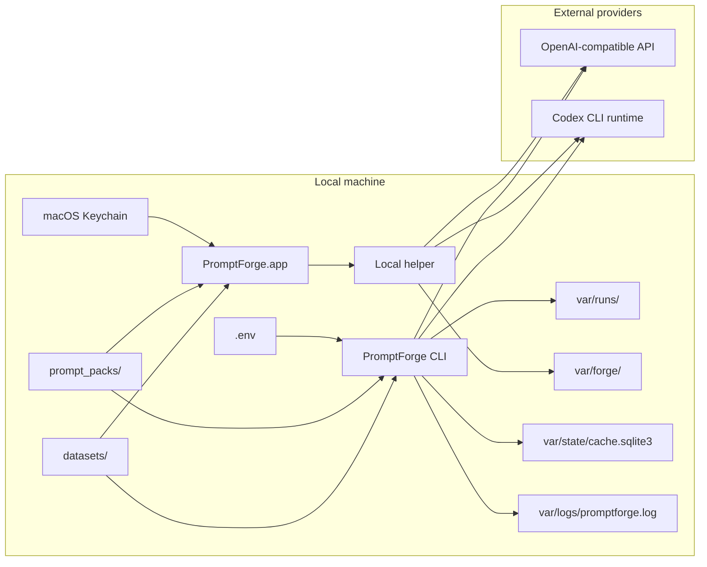

# Security and Safety

_Last verified against commit `065f5120dee568fe5b33c7565e7d62942d325db0`._

PromptForge is safer than a general agent runtime because it evaluates prompts,
not business actions. It does not write to external systems, mutate datasets, or
ship with approval-gated write tools.

That said, it still moves prompt and dataset content through external providers,
stores outputs locally, and allows a Codex-backed execution path. This document
describes the real trust boundaries in the current code.

## Secrets and auth model

| Provider path | Secret or auth source | Used by | Notes |
|---|---|---|---|
| `openai` | `OPENAI_API_KEY` | `get_openai_client()` | Direct `AsyncOpenAI` client |
| `openrouter` | `OPENROUTER_API_KEY`, `OPENROUTER_BASE_URL` | `get_openai_compatible_client("openrouter")` | OpenAI-compatible base URL path |
| `codex` | local `codex login` session or `codex login --with-api-key` | `CodexGateway` | PromptForge shells out to `codex exec` |

For the macOS app specifically:

- `PromptForge.app` now reads `OPENAI_API_KEY` and `OPENROUTER_API_KEY` from the
  macOS Keychain first when launching the local helper.
- The settings UI reports whether those keys are loaded, but it does not render
  the current secret values back into the interface.
- If the app inherits one of those keys from the current shell environment and
  the Keychain does not already have it, the app writes that key into the
  Keychain as a one-time migration path.
- The Python engine still supports `.env` for CLI-first workflows. Codex auth
  still relies on the local `codex login` session state, but the app can now
  launch that login flow from its settings UI.
- The app keeps prompt-scoped agent conversation history in local forge session
  files under `var/forge/<session_id>/chat_history.json`.

Secret source files:

- `.env.example` defines supported variables
- `.env` is loaded via `python-dotenv`
- `.env` is ignored by Git

## Trust boundaries

## Safe defaults in code

| Default | Where it lives | Effect |
|---|---|---|
| `store=False` for OpenAI-compatible requests | `src/promptforge/runtime/gateway.py` | PromptForge does not ask OpenAI-compatible providers to store requests |
| `PF_STDOUT_LOGS=false` | `.env.example`, `src/promptforge/core/config.py` | Structured logs go to file, not stdout, unless explicitly enabled |
| Codex sandbox defaults to `read-only` | `.env.example`, `src/promptforge/core/config.py` | Codex-backed runs start with a read-only sandbox configuration |
| No provider tools are passed for generation | `src/promptforge/runtime/gateway.py` | OpenAI-compatible generation is plain prompt execution, not tool use |
| Dataset validation before execution | `src/promptforge/prompts/loader.py` | Bad inputs fail before provider calls |
| Hard-fail policy markers | `src/promptforge/core/models.py` | Outputs containing known policy markers are zeroed out as failures |

## Important limitations

### There is no approval gate

PromptForge currently has:

- no human approval workflow
- no approval service
- no separate risk tier system

Its safety posture comes from limited scope:

- evaluate prompts
- record outputs
- score them
- write local artifacts

### Logs are redacted by key name, not full content analysis

The structured logger redacts payload keys containing markers such as:

- `api_key`
- `authorization`
- `secret`
- `token`
- `password`

It does not perform full content scanning. If a secret is embedded in a generic
string field, the logger will not automatically detect it.

### Outputs are stored locally

PromptForge stores raw model outputs in:

- `outputs.jsonl`
- `scores.json` summaries and evidence
- `report.md`
- the SQLite response cache
- forge session state such as prompt revisions, pending edits, and chat history

Do not run sensitive datasets unless local artifact retention is acceptable for
your environment.

### Judge payloads are rich

The judge request payload includes:

- prompt version and prompt name
- system prompt
- fully rendered user prompt
- the full dataset case
- the model output being judged

That payload is sent to the selected judge provider. It is not written to local
artifacts directly, but it does cross the provider boundary.

### Codex has a different risk shape than direct API calls

For Codex-backed execution:

- PromptForge invokes `codex exec` in the current working directory
- the prompt explicitly tells Codex not to inspect files, run shell commands, or use external tools
- the stronger runtime guard is the sandbox mode, which defaults to `read-only`

That means:

- direct OpenAI/OpenRouter generation has a narrower execution surface
- Codex can be useful when a team prefers Codex auth, but it carries a broader local execution context than plain API calls

## Data handling rules

- PromptForge never mutates dataset files.
- Cache writes only store output-side data and metadata, not the original case input.
- Reports summarize and quote model output evidence; they are meant for human consumption and should be treated as generated artifacts, not scrubbed records.
- `run.lock.json` stores hashes and config, not full prompts or case bodies.

## Operational guidance

- Keep `.env` local and out of shell history when entering secrets manually.
- Prefer `pf setup` over editing `.env` by hand if multiple providers are in use.
- Use `pf doctor` after any provider or model change.
- Delete `var/state/cache.sqlite3` if you need to invalidate local outputs.
- Prune `var/runs/` and archive reports intentionally if dataset content is sensitive.

## What PromptForge does not currently guarantee

- no tenant isolation
- no at-rest encryption for artifacts
- no secret manager integration
- no provider-independent retention guarantees
- no policy engine beyond hard-fail markers and format rules

## Source of truth

- [`../src/promptforge/core/config.py`](../src/promptforge/core/config.py)
- [`../src/promptforge/core/logging.py`](../src/promptforge/core/logging.py)
- [`../src/promptforge/runtime/gateway.py`](../src/promptforge/runtime/gateway.py)
- [`../src/promptforge/runtime/run_service.py`](../src/promptforge/runtime/run_service.py)
