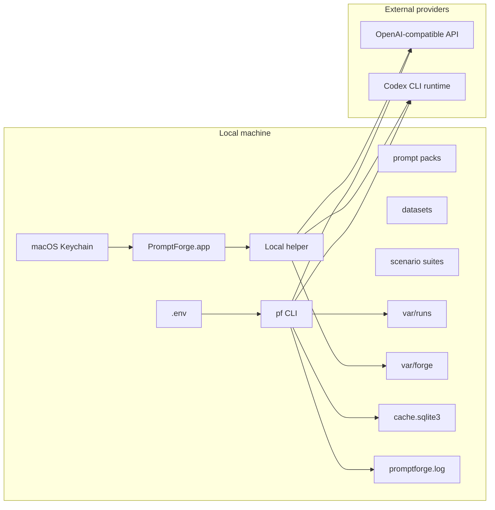

# Security And Safety

_Last verified against commit `4995d46a2ca16a3f56824412acc547118ed6d804`._

PromptForge is safer than a general-purpose agent platform because its core job
is prompt evaluation, not business-side automation. It still handles secrets,
model outputs, and provider requests, so the trust boundaries need to be clear.

## Security Posture In One Page

- local-first, file-backed runtime
- no hosted control plane
- no remote database
- no built-in human approval workflow
- provider requests leave the machine
- outputs and reviews are stored locally
- OpenAI-compatible requests ask providers not to store request data

## Auth And Secret Sources

| Surface | Secret or auth source | Used by | Notes |
|---|---|---|---|
| CLI | `.env` via `python-dotenv` | CLI runtime, batch runs, setup flow | standard developer path |
| App | macOS Keychain first, inherited env as fallback/migration | local helper launch | OpenAI/OpenRouter keys only |
| Codex | local `codex login` state | CLI and app when provider is `codex` | checked explicitly, not on every app status call |

Relevant settings:

- `OPENAI_API_KEY`
- `OPENROUTER_API_KEY`
- `OPENROUTER_BASE_URL`
- `PF_PROVIDER`
- `PF_JUDGE_PROVIDER`
- `PF_CODEX_BIN`
- `PF_CODEX_PROFILE`
- `PF_CODEX_SANDBOX`
- `PF_CODEX_REASONING_EFFORT`

Sources:

- [src/promptforge/core/config.py](../src/promptforge/core/config.py)
- [src/promptforge/setup_wizard.py](../src/promptforge/setup_wizard.py)
- [apps/macos/PromptForge/PromptForge/Item.swift](../apps/macos/PromptForge/PromptForge/Item.swift)

## Trust Boundary Diagram

## Safe Defaults In Code

| Default | Code path | Effect |
|---|---|---|
| `store=False` on OpenAI-compatible generation and judging | `src/promptforge/runtime/gateway.py` | PromptForge asks providers not to retain request payloads |
| Codex sandbox defaults to `read-only` | `src/promptforge/core/config.py` | Codex runs start from a narrower local execution posture |
| Prompt input validation before execution | `src/promptforge/prompts/loader.py` | malformed dataset cases fail before provider calls |
| Structured logging redacts sensitive key names | `src/promptforge/core/logging.py` | keys like `api_key`, `secret`, `token`, `password` are masked |
| App connection probes are on-demand | `src/promptforge/helper/server.py` | app status reads do not shell out to Codex by default |
| Staged prompt edits validate before swap | `src/promptforge/forge/service.py` | malformed staged edits should not overwrite the working prompt |

## What Leaves The Machine

### OpenAI and OpenRouter

Generation requests include:

- system prompt
- rendered user prompt
- metadata like run ID, case ID, prompt version, and config hash

Judge requests include:

- prompt version and name
- system prompt
- rendered prompt
- full dataset case
- model output being judged

### Codex

When provider or judge provider is `codex`, PromptForge shells out to:

- `codex exec`

Current guardrails:

- `--skip-git-repo-check`
- configured sandbox
- configured reasoning effort
- explicit prompt instruction telling Codex not to inspect files, run shell commands, or use external tools for generation

Important nuance:

- Codex still runs in the project working directory, so its risk shape is broader than a pure API request even with a read-only sandbox

## Data Handling Rules

- PromptForge never mutates dataset files.
- Prompt and scenario source files remain local unless their rendered contents are sent to a provider.
- Outputs are written locally to:
  - `outputs.jsonl`
  - `scores.json`
  - `comparison.json`
  - `report.md`
  - forge session files
  - the response cache
- `run.lock.json` records hashes and config, not full prompts or dataset bodies.

## What The App Exposes

The macOS app and helper exchange:

- prompt files
- prompt metadata
- review and playground payloads
- cached connection-status summaries

The app does not render raw API keys back into the UI.

For the app specifically:

- `status.get` and `settings.get` return cached connection information
- `connections.refresh` performs explicit provider probes
- empty projects are allowed and do not require secret material just to open

## Logging And Redaction Limits

PromptForge logs structured JSON events to `var/logs/promptforge.log`.

Redaction is key-name based, not full-content scanning.

That means:

- `api_key`, `secret`, `token`, `password`, and similar keys are masked
- arbitrary secret-looking strings embedded in generic fields are not automatically detected

Do not assume logs are safe for broad sharing unless you have reviewed them.

## Approval Gates And Risk Boundaries

PromptForge currently has no built-in approval system.

There is:

- no multi-user review workflow
- no role model
- no policy engine beyond deterministic hard-fail checks and local prompt-review decisions

Safety comes from scope reduction:

- evaluate prompts
- keep artifacts local
- make promotion explicit
- keep datasets immutable

## Known Limits

- no at-rest encryption for artifacts
- no secret manager integration beyond Keychain for app-held API keys
- no tenant isolation
- no provider-independent retention guarantee
- no remote audit service
- no content-aware log scrubbing

## Operational Guidance

- keep `.env` local and out of shell history
- use `pf setup` rather than hand-editing `.env` when switching providers
- treat `var/runs/`, `var/forge/`, and `cache.sqlite3` as potentially sensitive local artifacts
- if a dataset is sensitive, prune or archive artifacts intentionally after use
- refresh app connections from Settings when you need a live auth check

## Source Of Truth

- [src/promptforge/core/config.py](../src/promptforge/core/config.py)
- [src/promptforge/core/logging.py](../src/promptforge/core/logging.py)
- [src/promptforge/runtime/gateway.py](../src/promptforge/runtime/gateway.py)
- [src/promptforge/prompts/loader.py](../src/promptforge/prompts/loader.py)
- [src/promptforge/helper/server.py](../src/promptforge/helper/server.py)
- [apps/macos/PromptForge/PromptForge/Item.swift](../apps/macos/PromptForge/PromptForge/Item.swift)
