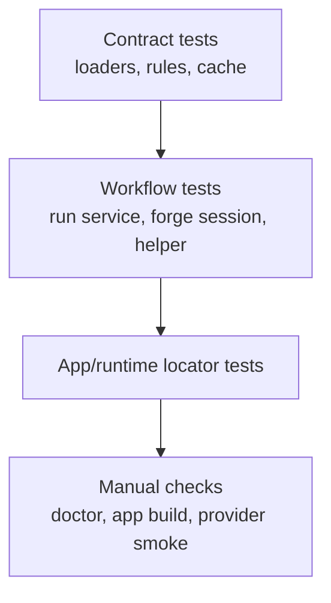
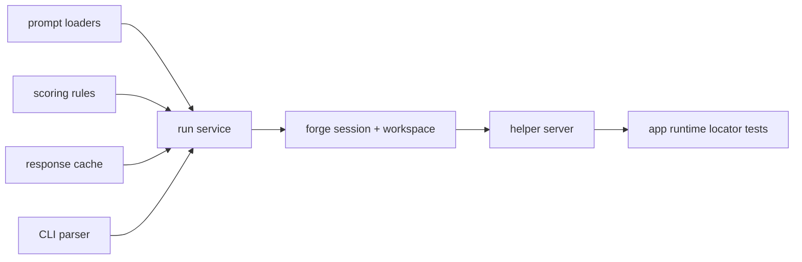

# Testing And Quality

_Last verified against commit `4995d46a2ca16a3f56824412acc547118ed6d804`._

PromptForge is tested primarily at the contract and orchestration layers.

That is deliberate:

- prompt behavior depends on external providers
- reproducible local workflow matters more than live-provider CI
- fake gateways make prompt-workspace and runtime tests deterministic

## Test Strategy



## How To Run Checks

### Python test suite

```bash
. .venv/bin/activate
pytest -q
```

### macOS app tests

```bash
xcodebuild \
  -project apps/macos/PromptForge/PromptForge.xcodeproj \
  -scheme PromptForge \
  -configuration Debug \
  -derivedDataPath apps/macos/PromptForge/build \
  test
```

### Environment and provider preflight

```bash
pf doctor
pf doctor --provider codex --judge-provider codex --model gpt-5-mini
```

### Optional smoke scripts

```bash
python -m promptforge.scripts.smoke_openai
python -m promptforge.scripts.smoke_eval
```

## Automated Coverage

| Test file | What it verifies |
|---|---|
| `tests/test_prompt_loader.py` | prompt loading, schema validation, render contract |
| `tests/test_scoring_rules.py` | deterministic rule checks and hard-fail behavior |
| `tests/test_cache_and_compare.py` | SQLite cache persistence and comparison-winner logic |
| `tests/test_run_service.py` | evaluation and comparison artifact generation |
| `tests/test_forge_session.py` | revisions, staged edits, rollback-safe apply flow, benchmarks, exports |
| `tests/test_workspace_service.py` | workspace-level prompt, scenario, playground, and decision flows |
| `tests/test_helper_server.py` | helper RPC contract, empty-project behavior, status/settings, event stream |
| `tests/test_setup_wizard.py` | onboarding flow and auth prompts |
| `tests/test_codex_gateway.py` | Codex schema normalization and timeout process cleanup |
| `tests/test_cli.py` | CLI parser and scenario/review/promote command flows |
| `apps/macos/PromptForge/PromptForgeTests/PromptForgeTests.swift` | launch argument parsing and bundled runtime locator behavior |

## Coverage Map



## Covered Well

- prompt contract loading
- dataset render path
- deterministic rule checks
- cache round-trips
- comparison winner logic
- run artifact creation
- helper RPC behavior
- empty-project helper/app contract
- forge revisions and staged edit safety
- Codex timeout cleanup
- workspace scenario/playground/review flows
- app runtime selection for bundled vs explicit engine roots

## Covered Less Well

- live OpenAI provider behavior in CI
- live OpenRouter provider behavior in CI
- live Codex provider behavior in CI
- UI-level behavior and layout regressions
- performance under large datasets
- artifact backward-compatibility across long-lived versions
- package reproducibility for release builds
- project-root/cwd assumptions across multiple simultaneous projects

## Quality Model

PromptForge uses four defenses:

1. input and schema validation
2. deterministic rule checks
3. structured rubric judging
4. durable human-readable artifacts

That means:

- a run can succeed operationally while the prompt still fails quality gates
- a judge failure can degrade scoring fidelity without crashing the whole run
- comparison can prefer the prompt that avoids hard-fails, even if prose style looks less polished

## Release Readiness Checklist

- [ ] `pytest -q` passes
- [ ] app tests pass if macOS app code changed
- [ ] `pf doctor` passes for the intended provider path
- [ ] at least one representative `pf run` completes cleanly
- [ ] if comparing versions, `pf compare` produces an understandable report
- [ ] `run.lock.json` reflects the intended provider, model, and hashes
- [ ] warnings in `scores.json` and `run.lock.json` are understood
- [ ] bundled app launches with a valid packaged runtime
- [ ] generated reports are acceptable to share
- [ ] local logs and artifacts do not expose secrets

## Recommended Manual Checks Before Public Release

- build `PromptForge.app`
- launch the built app outside the development repo context
- open an empty project and confirm onboarding works
- open an existing project and run:
  - quick check
  - scenario review
  - playground run
- validate the Settings connection refresh path

## Current Quality Risks

These are important even though the code is functional:

- release packaging now has a scripted path, but it still depends on a local Python build environment
- the helper/runtime still rely on project cwd in several code paths
- legacy `prompt_blocks` compatibility still exists in the prompt metadata contract even though the current UI is file-first

Those are production-readiness concerns, not broken examples.

## Source Of Truth

- [tests/test_prompt_loader.py](../tests/test_prompt_loader.py)
- [tests/test_scoring_rules.py](../tests/test_scoring_rules.py)
- [tests/test_cache_and_compare.py](../tests/test_cache_and_compare.py)
- [tests/test_run_service.py](../tests/test_run_service.py)
- [tests/test_forge_session.py](../tests/test_forge_session.py)
- [tests/test_workspace_service.py](../tests/test_workspace_service.py)
- [tests/test_helper_server.py](../tests/test_helper_server.py)
- [tests/test_setup_wizard.py](../tests/test_setup_wizard.py)
- [tests/test_codex_gateway.py](../tests/test_codex_gateway.py)
- [tests/test_cli.py](../tests/test_cli.py)
- [apps/macos/PromptForge/PromptForgeTests/PromptForgeTests.swift](../apps/macos/PromptForge/PromptForgeTests/PromptForgeTests.swift)
